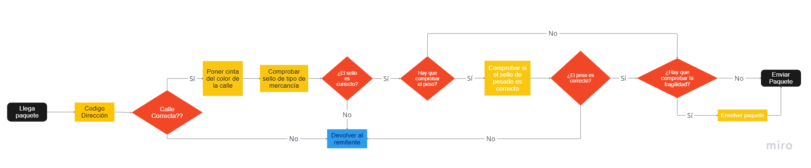

# FuMonoStudios (Mail to atlantis)

## Ficha Técnica
|Genero|Publico Objetivo|
|--|---|
|No se|Ni idea|
## Mecanicas

### Movimiento en la exploracion
*Hola* **esto** es un texto de ejemplo

la lista de la compra

1. huevos
2. pan

- elemento 1
- elemento 2

### Gestión de paquetes

La fase de gestión de **paquetes** consta de varias mecánicas que se irán aplicando de forma incremental (añadiendose a las mecánicas anteriores) cada ciertas *jornadas* (por determinar).

Al envíar un paqute de forma incorrecta el jugador recibirá una **amonestación**, con varias **amonestaciones** el jugador recibirá menos dinero al final de la *jornada*.

#### Direcciones
Cada paquete tendrá un bloque de texto donde se podrá leer: **nombre**, **cógido postal** y **barrio + calle**.

El jugador deberá comprobar que el **código postal** y el barrio son validos. Esto es que el **código postal** exista y que el **barrio** pertenezca al distrito al que va asociado el **codigo postal**. Para comprobar estas cosas el jugador cuenta con un **manual de trabajo** donde están enlistados los distritos con sus barrios.

##### Manual de trabajo

#### Etiquetado por barrio
En el caso de que la **dirección** sea correcta el jugador deberá emplear un sello del color correspondiente al barrio (ver en el **manual de trabajo**). Poner el color incorrecto o envíar el paquete teniendo la dirección incorrecta conllevará a una **amonestación**

#### Sello de tipo de paquete
Llegado cierto punto se exigirá al jugador detectar la falsificación de **sellos**. En el **manual de trabajo** se añadirá una entrada para ver los **sellos** auténticos. 

Existen 5 tipos de sellos:
- Alimento
- Medicinas
- Joyas
- Materiales
- Armamento

Enviar un paquete con un **sello** falso implica una **amonestación**

#### Pesado
Un paquete con un **sello de pesado** deberá ser pesado y comprobado respecto a el peso que le asigna el **sello** por tanto un paquete con este **sello** solo debe ser enviado si su peso medido en la balanza coincide con las métricas que indica el **sello** (referirse al **manual de trabajo**). Una vez presentada esta mecánica aparecerá una balanza en la oficina de trabajao donde se podrán pesar los **paquetes** colocándolos encima de estos.

#### Envoltura
Un paquete con un **sello de fragil** deberá ser envuelto con **cinta de embalaje**. Para ello el jugador deberá realizar un movimiento de *arriba abajo* sobre el **paquete** mientras sostiene el objeto de cinta de embalaje.

### Calculo de Finales y Felicidad

#### Finales
Cada personaje tiene asociada una barra de felicidad, dicha barra se va llenando o reduciendo dependiendo de si se envia correctamente un paquete (+1), se redirige un paquete para beneficiar lo que ha pedido uno de los NPC (+5), o se a estraviado el paquete que se dirigía a su distrito (-3). Dichas barras pueden ir desde el -X hasta el Y, teniendo diferentes puntos que actuan como flags. Si se reduce la felicidad al máximo de un NPC, da igual lo que se haga que esta ya no podrá volver a subir. Si no se llega hasta cierto punto, el NPC tendra un final malo, si se llega más o menos a un tercio de la barra el NPC tendra un final neutral, si se llega a dos tercios de la barra, el NPC tendra un final bueno y si se consigue llenar toda la barra el NPC tendra un final Maxi Feliz, el cual implique recibir una mejora de dicho NPC que facilita otra de las mecánicas del juego. Este comprobación del nivel de barras se hace al final de los 14 días de trabajo, en donde se analizarán y se iran poniendo los distintos finales de cada NPC mediante un texto. 

#### NPCs especiales (nice to have)
A parte de esto hay tres NPC especiales los cuales son el vagabundo, el secretario real y el campesino. Al ayudar a uno de estos si o si se reduce la felicidad de los otros siempre que sea mediante paquetes extraviados. Al llegar a la maxifelicidad de uno de ellos el día 14 incluira un día extra en el que el jugador deberá cumplir ciertos mandados para desbloquear su verdadero final, el cual afectara a toda la Atlantida y no solo a esos personajes personalmente. Si no se cumple el mandado saldra el final bueno por defecto. Aun con esto incluido, una vez se alcance la maxifelicidad el NPC te entregara la mejora para lo que queda de run.

#### Mejoras de los NPC
Los NPCs te entregaran un regalo que te hará la labor más fácil en el trabajo. Estos regalos una vez recibidos ya no se pueden perder, siendo una mejora permanente para el jugador, aunque si es posible que la felicidad del NPC reduzca después de eso. Estas mejoras son:

- Vagabundo: te da una cinta multicolor que se puede poner a los paquetes y vale para todas las calles
- Tarotisa: te entrega una bola de cristal que tiene 1/x posibilidad de lanzar un brillo cuando el paquete actual es erroneo
- Artesano: te permite envolver rapidamente un paquete tan solo pulsando E
- Campesino: te permite conocer el peso del paquete sin necesidad de usar la balanza
- Contable: hace que los paquetes bien entregados te den dinero extra por cada paquete que envies correctamente
- Soldado: te permite equivocarte con x paquetes antes de que se te aplique una penalización
- Secretario real: te permite pasar rapidamente el libro de instrucciones pulsando A y D sin necesidad de usar el ratón.

---

## Diseño
El juego constará de varias jornadas (todavía por decidir) donde el jugador tendrá que ir manteniendo su vida en Atlantis pagando el alquiler al final de varias jornadas y aprendiendo sobre sus habitantes. Cada fase constará de dos fases:

### Fase de exploracion

### Fase de gestión de paquetes

Durante la fase de gestíon el jugador deberá comprobar la validez de los **paquetes** esto llevará a distintos minijuegos que se irán añadiendo con el transcurso de los días. Cada nueva capa añadidida le irá obligando a estar más atento a los detalles en cada paquete.

Cada paquete que se envíe tendrá impacto en la actitud de los distintos npc *(felicidad)*. Esta *felicidad* tendrá un impacto en la fase de exploración.

---

## Arte
Aprtado para describir el arte del juego
### Paleta de color

---

## Narrativa

### Narrativa de Atlantis
Hace miles de años, el mundo era capaz espectador del punto máximo de una de las ciudades más avanzadas que jamas hayan existido, la Atlantida. Este pueblo griego del mediterraneo se destacaba por su gran tecnologia, bajo la cual sus habitantes prosperaban y vivian en paz. Sin embargo, esto provoco un sentimiento de soberbia absoluta en ellos, los cuales renegaron de los dioses que durante años habian venerado al sentir que ya no los necesitaban. Esto provoco la ira del Olimpo, en especial de poseidón, por lo que en un arrebato de rabia decidió echar tres maldiciones a los habitantes. La primera fue invocar un terremoto que acabaría hundiendo la civilización en el oceano. La segunda fue convertir a sus habitantes en diferentes amalgamas al ponerles características de seres marinos. Por último hizo que cada nueva generación de la ciudad fuera más ignorante que la anterior, provocando que toda la tecnología con la que alguna vez contaron se perdiera en el olvido. Afortunadamente antes de que la ciudad se hundiera del todo, los atlantes diseñaron y construyeron una cúpula la cual les protegiera del agua, de la presión de la profundidad y filtrase oxigeno del propio agua. Al final tras muchos años y generaciones, los atlantes lograron adaptarse a la vida oceanica, pero al mismo tiempo, olvidando todo lo que alguna vez sabian, incluyendo la existencia de los humanos a los cuales veían como un simple mito.

### Funcionamiento interno de la Atlantida
La Atlantida es una monarquía centralista, en la cual hay una gran división entre las diferentes clases sociales. La ciudad esta compuesta por varios distritos divididos por muros, teniendo una forma de anillos. En cada distrito reside una clase social u oficio diferente. En los cuatro distritos exteriores que conforman el primer anillo se encuentran: los campesinos (Distrito de Demeter), los artesanos (Distrito de Hefesto), los boticarios y adivinos (Distrito de Artemisa) y los desechos sociales (Distrito de Hestia). Después en el segundo anillo más al interior podemos encontrar dos distritos, el de los comerciantes (Distrito de Hermes) y el de los nobles (Distrito de Apolo). Por último en el centro de la ciudad se encuentra el castillo real, donde reside la monarquia y los diferentes criados que la atienden.

### Personajes

#### Protagonista
En el juego encarnamos a Paco Jones, un aventurero español de 35 años que tras innumerables fracasos acabo sus días trabajando en correos. Sin embargo, uno de sus monotonos dias de trabajo recibe una botella de cristal que en su interior tenía una gran revelación. Este lee que la carta viene de la Atlantida, por parte de un grupo que se hace llamar las lechuzas. Este, si bien al principio se muestra exceptico, acaba convenciendose gracias a una imagen en la que se ve un lugar rodeado de una cúpula con muchos hombres pez. Decidido a retomar su carrera como aventurero, decide guardarse la información para si mismo e intentar explorar esta maravillosa ciudad. Para lograr llegar a ella pide prestado un submarino bajo la promesa de devolverlo junto a una gran suma de dinero. También gasta sus ahorros para construirse un disfraz de pescado, para poder camuflarse entre los atlantes, ya que no sabia si estos serían hostiles o no. Tras un largo viaje logra llegar a la gran Atlantida, en donde, tras explorar un poco sus calles se encuentra con un hombre-salmón que cansado se su trabajo decide relegarlo en Paco. Dicho trabajo consistía en la gestión de correo de la Atlantida. Aunque de primeras esto no le convence, decide tomarlo para recaudar información. Es asi como inicía su gran aventura en Atlantis.

#### Campesino

#### Artesano

#### Vagabundo

#### Tarotisa

#### Soldado

#### Contable

Glover Globus es un pez globo que controla todo el comercio en el distrito de hermes. Su empresa se encarga de comprar los articulos hechos o cosechados por los campesinos a bajo precio y se lo vende a los nobles por un alto coste. A pesar de hacer esto Glover no es malo, sino que esta confuso. Desde pequeño vio como su padre realizaba estas estafas a los campesinos y artesanos, pero cuando se lo reclamo, el padre de Glover le mintió, diciendole que en realidad ellos le hacian un favor a los campesinos ya que si estos negociaran directamente con los nobles, estos les humillarían, maltratarían e incluso robarían al carecer de menos derechos que ellos. Le convenció de que al hacer de intermediarios les estaban ayudando y que la diferencia de dinero entre lo que ganaban vendiendo a los nobles y lo que les pagaban a ellos por sus productos se debe a una pequeña comisión que les debía cobrar, para asi sacar adelante la empresa. Glover se acabo convenciendo de esto por lo que paso sus días siguiendo con las estafas que realizaba su padre.

En cuanto a su apariencia, Glover es un hombre gordo con una gran papada, este tiene una cara inocente y sonriente. Viste con una traje negro, camisa blanca, corbata azul marino y unos zapatos marrones. También suele usar un sombrero de copa ridiculamente pequeño. En su americana se puede encontrar un pin con el logo de su empresa de comercio.

Sobre su pasado, a parte de lo de su padre se sabe que en su colegio le hacian bulling unos delfines matones, los cuales se la pasaban empujandole de un lado a otro. Esto le genero cierta timided e inseguridad, razon por la que siempre está inchado.

#### Secretario del rey

### Lugares

#### Oficina de trabajo

#### Distritos