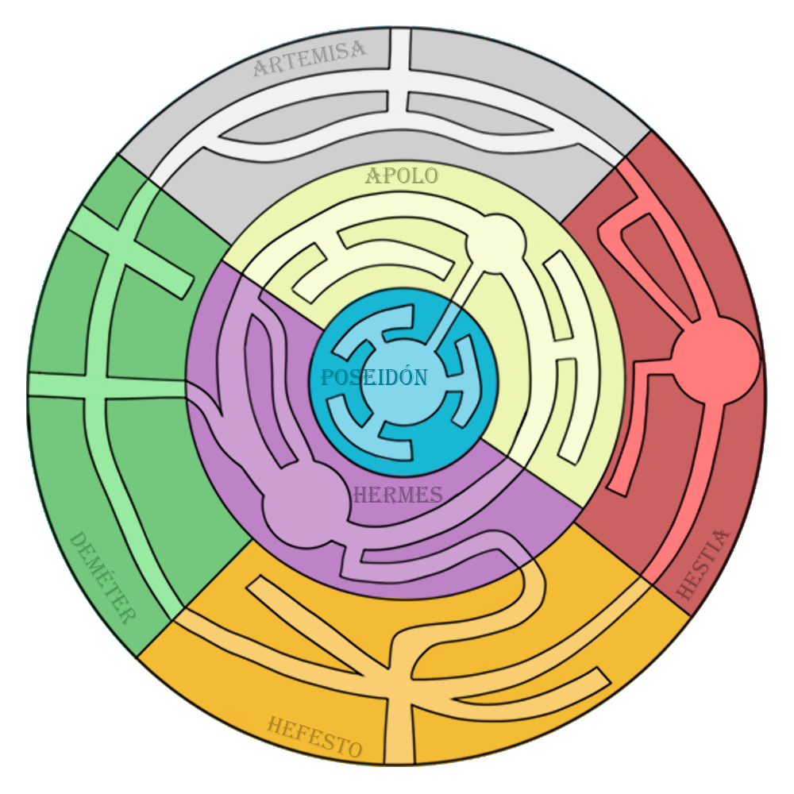
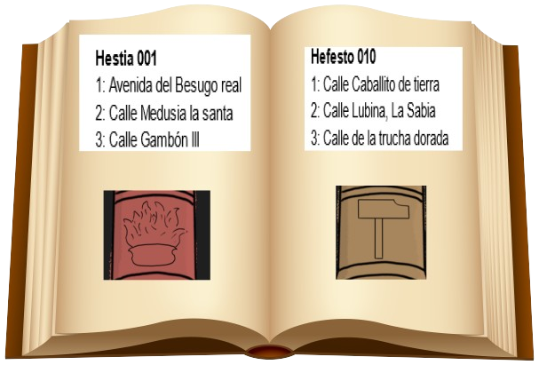
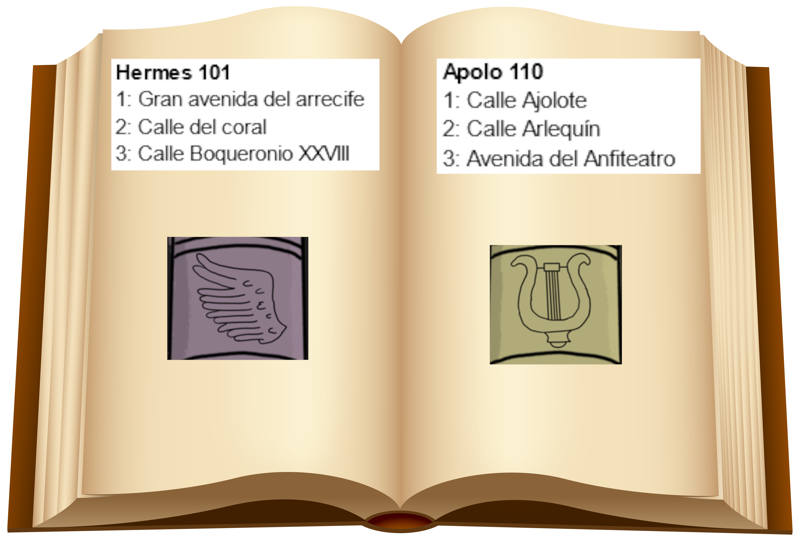
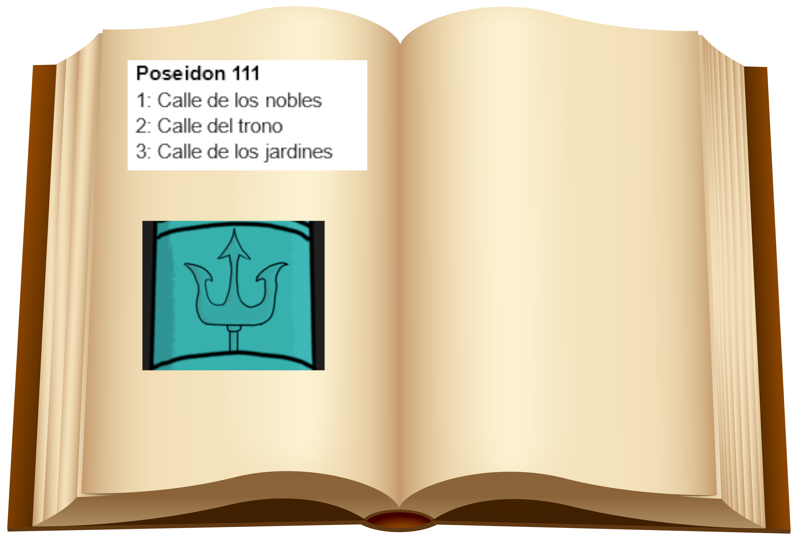
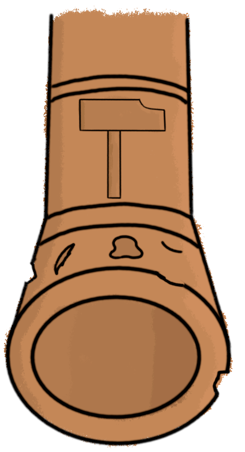
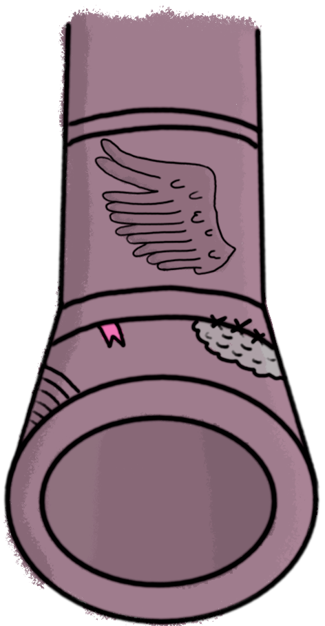

# FuMonoStudios (Mail to atlantis)

- [FuMonoStudios (Mail to atlantis)](#fumonostudios-mail-to-atlantis)
  - [Ficha Técnica](#ficha-técnica)
  - [Mecanicas](#mecanicas)
    - [Movimiento en la exploracion](#movimiento-en-la-exploracion)
    - [Dialogos con los NPC](#dialogos-con-los-npc)
    - [Gestión de paquetes](#gestión-de-paquetes)
      - [Direcciones](#direcciones)
        - [Manual de trabajo](#manual-de-trabajo)
      - [Etiquetado por barrio](#etiquetado-por-barrio)
      - [Sello de tipo de paquete](#sello-de-tipo-de-paquete)
      - [Pesado](#pesado)
      - [Envoltura](#envoltura)
      - [Cálculo del dinero al final de la jornada](#cálculo-del-dinero-al-final-de-la-jornada)
    - [Calculo de Finales y Felicidad](#calculo-de-finales-y-felicidad)
      - [Finales](#finales)
      - [NPCs especiales](#npcs-especiales)
      - [Mejoras de los NPC](#mejoras-de-los-npc)
      - [Hablar con personajes](#hablar-con-personajes)
      - [Funcionamiento de eventos/sidequest de los NPC](#funcionamiento-de-eventossidequest-de-los-npc)
  - [Diseño](#diseño)
    - [Fase de exploracion](#fase-de-exploracion)
    - [Fase de gestión de paquetes](#fase-de-gestión-de-paquetes)
    - [Fase de dinero](#fase-de-dinero)
  - [Arte](#arte)
    - [Paletas de color](#paletas-de-color)
    - [Lugares](#lugares)
      - [Oficina de trabajo](#oficina-de-trabajo)
      - [Distritos](#distritos)
  - [Narrativa](#narrativa)
    - [Narrativa de Atlantis](#narrativa-de-atlantis)
      - [Funcionamiento interno de la Atlantida](#funcionamiento-interno-de-la-atlantida)
    - [Personajes](#personajes)
      - [Protagonista](#protagonista)
      - [Jefe oficina](#jefe-oficina)
    - [NPC Grandes](#npc-grandes)
      - [Vagabundo](#vagabundo)
    - [Finales](#finales-1)
      - [Secretario del rey](#secretario-del-rey)
        - [Finales](#finales-2)
    - [NPC Menores](#npc-menores)
      - [Campesino](#campesino)
        - [Finales](#finales-3)
      - [Artesano](#artesano)
        - [Finales](#finales-4)
      - [Tarotisa](#tarotisa)
        - [Finales](#finales-5)
      - [Soldado](#soldado)
      - [Contable](#contable)
        - [Finales](#finales-6)
    - [Dialogos](#dialogos)
      - [Contable](#contable-1)
      - [Tarotista](#tarotista)
      - [Artesano](#artesano-1)
      - [Campesino](#campesino-1)
  - [1º](#1º)
  - [2º](#2º)
  - [3º](#3º)
  - [4º](#4º)
  - [5º](#5º)
      - [Tarotista](#tarotista-1)

---

## Ficha Técnica
|Genero|Publico Objetivo|
|--|---|
|Simulación|Jugadores interesados en los Indies|

[UML](https://lucid.app/lucidchart/29f6e8d3-db3a-4b3c-98d9-a0ec94f8a0d4/edit?view_items=jGC~qOX6U6pG&invitationId=inv_555ab00b-17ce-4af3-80db-82f253f680ba)

---

## Mecanicas

### Movimiento en la exploracion
Para explorar la Atlántida se mostrarán imágenes de las calles donde podrá seleccionar hacia donde ir clicando en las direcciones de las calles, estilo *Profesor Layton*. Cada vez que se clickea una flecha se cambia de un distrito a otro. En cada distrito siempre habrá un **NPC** con el cual se podra hablar. Este podra dejarte **encargos** en algunas ocasiones mientras que te contara un poco de su vida en otras. No es podible acceder a todos los distritos desde todos los distritos, estando conectados: todos los distritos en un mismo anillo, los distritos de Demeter y Hefesto con el de Hermes y el distrito de Apolo con el de Poseidón. Según pasen los días se iran desbloqueando el acceso a los distintos anillos, pudiendo al principio solo acceder a los **exteriores**, despues al **interior** y por último al **castillo real**.

### Dialogos con los NPC
Al hacer clic sobre un NPC mientras se está en la fase de exploración se mostrará en pantalla un cuadro de diálogo con lo que te dice dicho NPC, dicho dialogo puede ser tanto un encargo de correo como simplemente algo de información sobre la historia de ese NPC y su entorno. Si un jugador vuelve a hablar con el NPC aparecera un dialogo predeterminado con el cual el jugador en el que le indicara que deje de molestarlo o que esta ocupado, cortando asi la conversación. 

En total hay 4 tipos de dialogos, primero los dialogos de favores en donde le explicaran los NPC al jugador una adversidad y le pediran su ayuda mediante la desviación del correo. El segundo tipo son los dialogos de contexto, los cuales varían según el nivel de felicidad de los NPC y estos sirven tanto para informarte de la situación personal del NPC como su entorno. Después hay un dialogo Maxifeliz el cual te dice el NPC una vez alcanzas la felicidad máxima con él, haciendote entrega de un regalo con ello. Y por último esta el dialogo de perdida, que es un dialogo que aparece cuando haces totalmente infeliz al NPC, lo que supone en una perdida completa de la progresión de este. 

### Gestión de paquetes

La fase de gestión de **paquetes** consta de varias mecánicas que se irán aplicando de forma incremental (añadiendose a las mecánicas anteriores) cada ciertas *jornadas* (por determinar).

Al envíar un paqute de forma incorrecta el jugador recibirá una **amonestación**, con varias **amonestaciones** el jugador recibirá menos dinero al final de la *jornada*.

#### Direcciones
Cada paquete tendrá un bloque de texto donde se podrá leer: **nombre**, **cógido postal** y **barrio + calle**.

El jugador deberá comprobar que el **código postal** y el barrio son validos. Esto es que el **código postal** exista y que el **barrio** pertenezca al distrito al que va asociado el **codigo postal**. Para comprobar estas cosas el jugador cuenta con un **manual de trabajo** donde están enlistados los distritos con sus barrios.

|Codigo|Distrito|Calles|
|---|---|---|
|001|Hestia|"Avenida del Besugo real" "Calle Medusia la santa" "Calle Gambon III"|
|010|Hefesto|"Calle Caballito de tierra" "Calle Lubina, La Sabia" "Calle de la trucha dorada"|
|011|Demeter|"Gran ruta de las algas"  "Camino del calamar"  "Camino de la morena"|
|101|Artemisa|"Avenida Mantarraya" "Calle de la ballena tiburona" "Calle Rodaballo"|
|101|Hermes|"Gran Avenida del Arrecife" "Calle del Coral" "Calle Boqueronio XXVIII"|
|110|Apolo|"Calle Ajolote" "Calle Arlequin" "Avenida del Anfiteatro"|
|111|Poseidon|"Calle de los nobles" "Calle del trono" "Calle de los Jardines"|

##### Manual de trabajo
El jugador contará con una libreta que podrá abrir (situada en la zona inferior derecha). En esta se podrán ver distintas páginas que explicarán en cada una de ellas las mecánicas sobre los paquetes que el jugador tenga disponibles. Por tanto debe haber las siguientes páginas al final de juego:
 - [Direcciones y cintas de colores](#direcciones)
 - [Sellos](#sello-de-tipo-de-paquete)
 - [Pesos](#pesado)
 - [Explicación de envoltura](#envoltura)
 - Anotaciones sobre la historia (nice to have).

|Ejemplos|a|
|-|-|
|||
||

#### Etiquetado por barrio
En el caso de que la **dirección** sea correcta el jugador deberá emplear un sello del color correspondiente al barrio (ver en el **manual de trabajo**). Poner el color incorrecto o envíar el paquete teniendo la dirección incorrecta conllevará a una **amonestación**

#### Sello de tipo de paquete
Llegado cierto punto se exigirá al jugador detectar la falsificación de **sellos**. En el **manual de trabajo** se añadirá una entrada para ver los **sellos** auténticos. 

Existen 5 tipos de sellos:
|Alimento|Medicinas|Joyas|Materiales|Armamento
|-|-|-|-|-|
||||||

Enviar un paquete con un **sello** falso implica una **amonestación**

#### Pesado
Un paquete con un **sello de pesado** deberá ser pesado y comprobado respecto a el peso que le asigna el **sello** por tanto un paquete con este **sello** solo debe ser enviado si su **peso** medido en la **balanza** coincide con las métricas que indica el **sello** (referirse al **manual de trabajo**). Una vez presentada esta mecánica aparecerá una balanza en la oficina de trabajao donde se podrán pesar los **paquetes** colocándolos encima de estos.

#### Envoltura

Un paquete con un **sello de fragil** deberá ser envuelto con **cinta de embalaje**. Para ello el jugador deberá realizar un movimiento de *arriba abajo* sobre el **paquete** mientras sostiene el objeto de cinta de embalaje.

#### Cálculo del dinero al final de la jornada
Al final de la jornada se abonará al jugador cierta cantidad de dinero siguiendo el siguiente cálculo

> Envíos correctos * 20 - Envíos Erroneos * 50

Tras saber cuanto recibe el jugador se le quitará lo correspondiente para pagar el alquier. Si el jugador se queda sin dinero implica fin de partida.

### Calculo de Finales y Felicidad

#### Finales
Cada personaje tiene asociado un parámetro de felicidad, dicho valor va aumentando o reduciendose dependiendo de si se envia **correctamente un paquete** (+1/-1), se redirige un paquete para **beneficiar** lo que ha pedido uno de los NPC (+5), o se a **extraviado** el paquete que se dirigía a su distrito (-3). 

La felicidad puede ir desde el -X hasta el Y, teniendo diferentes puntos que actuan como flags. 

Condiciones del comportamiento de la felicidad:

- Envío de lo que ha pedido un NPC (+5 felicidad)
- Envío extraviado de lo que ha pedido un NPC (-5 felicidad)
- Si se reduce la felicidad al máximo de un NPC, da igual lo que se haga que esta ya no podrá volver a subir. 
- Si no se supera cierto umbral, el NPC tendra un final malo, si se llega más o menos a un tercio de la barra el NPC tendra un final neutral, si se llega a dos tercios de la barra, el NPC tendra un final bueno y si se consigue llenar toda la barra el NPC tendra un final Maxi Feliz, el cual implique recibir una mejora de dicho NPC que facilita otra de las mecánicas del juego. 

Este comprobación del nivel de barras se hace al final de los 14 días de trabajo, en donde se analizarán y se iran poniendo los distintos finales de cada NPC mediante un texto. 

#### NPCs especiales
A parte de esto hay dos NPC especiales los cuales son el vagabundo y el secretario real. Al ayudar a uno de estos si o si se reduce la felicidad de los otros siempre que sea mediante paquetes extraviados. Al llegar a la maxifelicidad de uno de ellos el día 14 incluira un día extra en el que el jugador deberá cumplir ciertos mandados para desbloquear su verdadero final, el cual afectara a toda la Atlantida y no solo a esos personajes personalmente. Si no se cumple el mandado saldra el final bueno por defecto. 
Además las misiones siguen una historia lineal que es la principal historia del juego, de manera que si haces la misión del día 1, la del día 3 la ignoras y el día 5 si que hablas con él, tendrás la misión correspondiente al día 3 en vez del día 5, y en el día 6 tendrás la del día 4 y así. Es decir, que debes hacer misiones todos los días o el juego cortará la historia a la mitad ya que sí o sí al acabar el día 14 se acaba el juego ya que te pillan y eres deportado.
 Esto hará que si ignoras por mucho tiempo a los NPC no podrás rellenar por completo su barra de felicidad, así que es importante cumplir misiones todos los días.

#### Mejoras de los NPC
Los NPCs te entregaran un regalo que te hará la labor más fácil en el trabajo. Estos regalos una vez recibidos ya no se pueden perder, siendo una mejora permanente para el jugador, aunque si es posible que la felicidad del NPC reduzca después de eso. Estas mejoras son:

- **Vagabundo**: te da una cinta multicolor que se puede poner a los paquetes y vale para todas las calles
- **Tarotisa**: te entrega una bola de cristal que tiene 1/x posibilidad de lanzar un brillo cuando el paquete actual es erroneo
- **Artesano**: te permite envolver rapidamente un paquete tan solo pulsando E
- **Campesino**: te permite conocer el peso del paquete sin necesidad de usar la balanza
- **Contable**: hace que los paquetes bien entregados te den dinero extra por cada paquete que envies correctamente
- **Soldado**: te permite equivocarte con x paquetes antes de que se te aplique una penalización
- **Secretario real**: te permite pasar rapidamente el libro de instrucciones pulsando A y D sin necesidad de usar el ratón.

#### Hablar con personajes
Al hacer click sobre un NPC durante la **fase de exploración**, se abrirá una pantalla donde el NPC hablará con el jugador diciendo sus lineas de diálogo. El jugador podrá pasar los bloques de texto con un botón (todavía por determinar).

Si el jugador vuelve a hablar con un NPC este dirá un diálogo reducido.

Tras el trascurso de varios días el jugador vera **limitado** el número de personajes con los que puede hablar. En el momento que exceda ese número acabará la **fase de exploración** y se irá a la **fase de revisión de paquetes**.

#### Funcionamiento de eventos/sidequest de los NPC
Cada NPC tendrá misiones que asignar al jugador. En estas misiones habrá una condicion concreta que tendrá que cumplir sobre un tipo de paquetes que va en contra de lo legal, por lo que será amonestado por ella, por lo que el jugador debe controlar cuanto quiere ayudar a los NPC mientras mantiene un nivel de dinero alto.
F

---

## Diseño
El juego constará de varias jornadas (todavía por decidir) donde el jugador tendrá que ir manteniendo su vida en Atlantis pagando el alquiler al final de varias jornadas y aprendiendo sobre sus habitantes. Cada fase constará de dos fases:

### Fase de exploracion

En esta fase el jugador podra recorrer el mapa en primera persona moviendose por los distintos distritos de la Atalantida. En cada distrito podra encontrar a un NPC específico del distrito el cual le contará algo de su historia o le pedira un favor relacionado con el correo. En un principio los barrios de los anillos más interiores estarán bloqueados pero a partir del segundo y tercer día en el que se introduzca una nueva mecánica estos estarán libres.

### Fase de gestión de paquetes

Durante la fase de gestíon el jugador deberá comprobar la validez de los **paquetes** esto llevará a distintos minijuegos que se irán añadiendo con el transcurso de los días. Cada nueva capa añadidida le irá obligando a estar más atento a los detalles en cada paquete.

*Amonestaciones*
: El **número de paquetes** que se puede **fallar** sin penalizar en el ingreso al final del día irá **bajando** conforme avanzan los días. Se *avisará* al jugador cuando le falte 1 fallo para penalizar. Una vez penalizado, el **ingreso** del día del jugador se **dividirá por 2** y por cada **paquete fallado más** allá se irá bajando un **5 por ciento a lo que queda**, es decir, si queda por cobrar 100 y se falla uno, se restará un 5 por ciento de 100 que son 5, luego 5 por ciento de 95 y así.

*Condiciones especiales del jefe Oficina*
: El *día después de añadir una mecánica*, es decir, los **días impares** salvo el 1, el jefe te esperará en la oficina para decirte una **condición extra** que debes cumplir para **todos los paquetes**. Esto afectará a todos, sean de NPC o no. Un ejemplo sería "*Ha habido obras en el transporte de paquetes a Demeter, todos los paquetes dirigidos a Demeter deben ser descartados*". Si incumples esto, **contará como fallo**.

*Paquetes especiales de NPC*
: Los NPC podrán **asignar eventos** que spawneen paquetes especiales a lo largo de la jornada. Estos paquetes compondrán una lista que poco a poco irán saliendo intentando salir todos antes de acabar el tiempo. Si el jugador promedio consiguiese 30 paquetes en ese día se enseñarán todos los paquetes de evento hasta antes del paquete 20. Estos paquetes serán completamente idénticos a los que pueden salir en ese día, salvo las cualidades especiales que lleve el evento.
Por ejemplo, la medium pide que los paquetes de medicina que van hacia el distrito hestia vayan hacia el distrito de demeter, y en total serán 3.
Estos paquetes serán identicos al resto, es decir, si en ese día se ha desbloqueado el sello de pesaje, estos paquetes podrán llevar el sello de pesaje y así. Es de notar que serán correctos, osea que no tendrán nada ilegal ni fuera de lugar, lo único que cambiará será las características del evento, en el caso del medium, será que mandará medicinas y irá a Hestia.
Si queda **1 minuto de juego**, los paquetes que falten por salir **saldrán 100%** para evitar penalizar a jugadores muy lentos.
Si *se mandan a donde deben ir*, **no penalizarán**, pero **no hará feliz** al NPC, sin embargo *si hacemos lo que pidió el evento*, **penalizará** y el **NPC será feliz**.

Estos eventos pueden ser sobre todo tipo de características de los paquetes, *no dejar pasar paquetes de un nombre*, *redirigir paquetes de medicina de un distrito a otro*, *descartar paquetes que pesen X*, *tirar todos los paquetes de una calle*, etc...

Para facilitar este sistema y evitar que salgan más fallos de los que tienen que ser, cada evento tendrá un número de paquetes que van a salir, y se añadirá a una lista los paquetes que no podrán salir de forma random. Por ejemplo, si un evento hace que los paquetes de medicina de Hestia deben ser eliminados y que van a salir 2, haremos que durante el día no puedan salir generados de forma random paquetes de medicina de Hestia, para que no se genere uno random y en vez de 2 salgan 3 y así.
Luego se añadirá a una queue los paquetes especiales que deben salir y saldrán dispersados durante el día.

La probabilidad $X$ de que salga un paquete especial tomando una queue de tamaño $N$, un promedio de paquetes de un jugador promedio $P$, y el paquete actual $i$

$$X = \frac{N + i + 1}{30} * 100$$

### Fase de dinero

Una vez terminado la fase de trabajo, saldrá una pantalla con texto que explique el dinero actual, el dinero a pagar del alquiler, los fallos y los bonus conseguidos en el minijuego.
En caso de quedarte sin dinero, saldrá el game over de quedarse sin dinero (te deportan de Atlantis)

## Arte
Al irnos moviendo por los diferentes distritos, lo haremos a través de diferentes pantallas con fondos estáticos en primera persona. Los fondos tendrán un estilo artístico simple inspirado e juegos como profesor Layton, con una paleta de colores sencilla estilo acuarela donde los objetos lejanos tendrán menos detalle o estarán más difuminados mientras que los objetos mas cercanos tendrán mas detalle, aunque como es una paleta de colores tirando a acuarela a veces los colores se pueden salir de las líneas como pasa en la película de 101 Dalmatas de Disney (la animación antigua, no el remake live action). En los escenarios de exploración encontraremos algunos personajes con los que poder interactuar teniendo una forma física en su diseño inspirada en juegos como profesor Layton por su estilo caricaturesco. Sin embargo, los personajes con los que interactuaremos tendrán más detalle que el resto dando igual las distancias, es decir, siempre estarán enfocados.

La parte estética de los escenarios se basará en una arquitectura griega antigua, teniendo como referencia a juegos como Assassin's Creed Odyssey.

### Paletas de color
Los fondos de la ciudad de la Atlántida tendrán una paleta de colores similar de grises y blancos, con un color extra predominante único de cada distrito: En el distrito de Démeter será el verde, en el de Hefesto el naranja, en el de Hestia el rojo, en el de Artemisa el gris, en el de Hermes el morado, en el de Apolo el amarillo y en el de Poseidón el azul.

### Lugares

#### Oficina de trabajo

Tubos donde se envían los paquetes
|a|b|c|d|e|f|g|
|-|-|-|-|-|-|-|
||  || | |  ||
#### Distritos

---

## Narrativa

### Narrativa de Atlantis
Hace miles de años, el mundo era capaz espectador del punto máximo de una de las ciudades más avanzadas que jamas hayan existido, la Atlantida. Este pueblo griego del mediterraneo se destacaba por su gran tecnologia, bajo la cual sus habitantes prosperaban y vivian en paz. Sin embargo, esto provoco un sentimiento de soberbia absoluta en ellos, los cuales renegaron de los dioses que durante años habian venerado al sentir que ya no los necesitaban. Esto provoco la ira del Olimpo, en especial de poseidón, por lo que en un arrebato de rabia decidió echar tres maldiciones a los habitantes. La primera fue invocar un terremoto que acabaría hundiendo la civilización en el oceano. La segunda fue convertir a sus habitantes en diferentes amalgamas al ponerles características de seres marinos. Por último hizo que cada nueva generación de la ciudad fuera más ignorante que la anterior, provocando que toda la tecnología con la que alguna vez contaron se perdiera en el olvido. Afortunadamente antes de que la ciudad se hundiera del todo, los atlantes diseñaron y construyeron una cúpula la cual les protegiera del agua, de la presión de la profundidad y filtrase oxigeno del propio agua. Al final tras muchos años y generaciones, los atlantes lograron adaptarse a la vida oceanica, pero al mismo tiempo, olvidando todo lo que alguna vez sabian, incluyendo la existencia de los humanos a los cuales veían como un simple mito.

#### Funcionamiento interno de la Atlantida
La Atlantida es una monarquía centralista, en la cual hay una gran división entre las diferentes clases sociales. La ciudad esta compuesta por varios distritos divididos por muros, teniendo una forma de anillos. En cada distrito reside una clase social u oficio diferente. En los cuatro distritos exteriores que conforman el primer anillo se encuentran: los campesinos (Distrito de Demeter), los artesanos (Distrito de Hefesto), los boticarios y adivinos (Distrito de Artemisa) y los desechos sociales (Distrito de Hestia). Después en el segundo anillo más al interior podemos encontrar dos distritos, el de los comerciantes (Distrito de Hermes) y el de los nobles (Distrito de Apolo). Por último en el centro de la ciudad se encuentra el castillo real, donde reside la monarquia y los diferentes criados que la atienden.

### Personajes

#### Protagonista
En el juego encarnamos a Paco Jones, un aventurero español de 35 años que tras innumerables fracasos acabo sus días trabajando en correos. Sin embargo, uno de sus monotonos dias de trabajo recibe una botella de cristal que en su interior tenía una gran revelación. Este lee que la carta viene de la Atlantida, por parte de un grupo que se hace llamar las lechuzas. Este, si bien al principio se muestra exceptico, acaba convenciendose gracias a una imagen en la que se ve un lugar rodeado de una cúpula con muchos hombres pez. Decidido a retomar su carrera como aventurero, decide guardarse la información para si mismo e intentar explorar esta maravillosa ciudad. Para lograr llegar a ella pide prestado un submarino bajo la promesa de devolverlo junto a una gran suma de dinero. También gasta sus ahorros para construirse un disfraz de pescado, para poder camuflarse entre los atlantes, ya que no sabia si estos serían hostiles o no. Tras un largo viaje logra llegar a la gran Atlantida, en donde, tras explorar un poco sus calles se encuentra con un hombre-salmón que cansado se su trabajo decide relegarlo en Paco. Dicho trabajo consistía en la gestión de correo de la Atlantida. Aunque de primeras esto no le convence, decide tomarlo para recaudar información. Es asi como inicía su gran aventura en Atlantis.

#### Jefe oficina
El jefe dirige la oficina de correos y es el encargado de comprobar que todo vaya bien por la oficina y que trabajes acorde a las cuotas. 
Lo conoces en la puerta de la oficina, cabreado contigo, ya que llevas el uniforme de trabajo y el anterior empleado salió corriendo dejandote su trabajo, y será estricto contigo ya que últimamente no se ha estado trabajando bien.
El jefe de oficina será encargado de pagarte cuando acabas los días, así como amonestarte si cometes muchas infracciones.
De normal no te lo encontrarás en la fase de exploración salvo en los días 1, 5 y 10 que te explicará algo. En los días 5 y 10 te desbloqueará distritos ya que te has estado portando bien.

### NPC Grandes

#### Vagabundo

Anemos Tokugawa es actualmente un vagabundo que pasa sus días bebiendo con el poco oricalco del que dispone en los barrios más bajos de Atlántida, aunque no siempre fue así. En su momento Anemos fue el verdadero heredero del trono de la Atlántida, por lo tanto es uno de los pocos habitantes de la misma que poseen cierto conocimiento sobre los humanos, este conocimiento se fue pasando generación a generación entre los herederos al trono de la Atlántida. Sin embargo, antes de que pudiera conocer toda la verdad sobre los humanos y su historia, su padre, el cual le estaba instruyendo en dichos conocimientos, fue asesinado por el secretario real mediante veneno. Todo esto paso ante la atenta mirada de Anemos, el cual rapidamente fue amenazado y drogado por el secretario real. 
Cómo se llevó a cabo la traición: El secretario real obtuvo veneno de pez globo del mismísimo padre de Glover Globus a cambio de ser este mismo el que manejara todo el comercio atlante.
Estuvo malviviendo en las calles del distrito de Hestia mendigando, rebuscando los cubos de basura y robando en los otros distritos, lo cual le permitió tener una visión más amplia de las injusticias sufridas por cada distrito del reino.
En la actualidad toda la información sobre los humanos y su propio destino como rey le es indiferente y se encuentra en un penoso estado maldiciendo su miserable vida.
Actúa de forma amigable y de colegueo con el protagonista, y de forma filosófica y fuerte cuando habla sobre su situación con el secretario del rey. Cree que Poseidón ha abandonado a su pueblo y 
APARIENCIA: Anemos es una carpa koi, la cual se encuentra en un estado de extrema hambruna. este viste con unos ropajes rasgados y holgados que usa para ocultar su lamentable estado. Este oculta su cara con una capucha, asomando únicamente su boca, bigotes y perilla. Este tiene colores vivos a pesar de estos, siendo principalmente el blanco y el rojo.

### Finales
MaxiFinal:

Malo (No consigues maxiFinal con ningún NPC grande):

#### Secretario del rey

Gargafiel Mustaki es un pez gato de tamaño diminuto el cual nació y se crió en el distrito de Hestia. Desde pequeño mostró una gran ambición y una necesidad casi psicótica de controlar todo a su alrededor. Esta obsesión le provocó diferentes problemas en todos los sitios a los que intentaba ir a trabajar, ya que no le gustaba recibir órdenes de nadie. Poco a poco en sus puestos de trabajo sus superiores desaparecen en circunstancias sospechosas pero debido a su extremadamente pequeño tamaño y su habilidad para desviar la atención, nadie sospechaba de él. Fue de esta forma como poco a poco fue escalando posiciones socialmente, pasando de campesino peón a líder de campo, de ahí a aprendiz de artesano para después volverse un maestro de las herramientas, después inició un periodo como pequeño vendedor a la nobleza, hasta que poco a poco se le asignó la venta de productos a su majestad. Una vez conoció a este, utilizó su fina labia para embaucar y que así le diera un cargo dentro del castillo. Poco a poco gracias a sus acertados consejos que le daba al rey, se fue ganando su favor hasta acabar siendo su mano derecha. Sin embargo, un día que investigaba la biblioteca real, se topó con un libro que revelaba la existencia de los humanos y la superficie. Esto le impactó de primeras, lo que en poco tiempo acabó convirtiéndose en una rabia hacia el rey debido a que sentía menosprecio hacia su persona por no revelarle tal noticia, teniendo él que descubrirlo por su cuenta. Es por ello que convencido de la ineptitud del rey decide asesinarlo con la ayuda de un comerciante llamado Glande Globus, el cual accedió darle veneno a cambio de una mejor posición en el distrito de Hermes. Una vez consiguió dicho brebaje envenenó al rey sirviendo una taza con dicha ponzoña. Esto acabó matando al rey, todo ello bajo los ojos de su único heredero, en aquel entonces de 8 años. Gargafiel decido amenazarle y drogarle, dejándole a su suerte en el distrito de Hestia. Por último decidió reinar la Atlántida desde las sombras, ocultando en todo momento el estado del rey bajo la excusa de que le protegía de un atentado terrorista. En cuanto a la información sobre los humanos, decidió guardarla por el momento, para evitar así un estado de histeria colectiva que acabase revelando su horrible delito. 
Actúa de forma cordial y amenazante con el protagonista, también de forma ambiciosa y loca cuando habla de su afán por conocer humanos. Cree que Poseidón creó la especie de los pez-humano como superiores a los seres humanos, y para comprobar si son dignos, les castigó a vivir en las mayores profundidades. Cree que si llegan a la superficie, Poseidón les ayudará a reconquistar el exterior y vivir a sus anchas.

Gargafiel es un pez gato de estatura diminuta, con ojos achinados y un gran y largo bigote. Este tiene una expresión sería y enfadada. Casi siempre se dirige con prepotencia a la gente y viste una larga sotana de tonos azul marinos unida por unos trozos de madera enrollados.

Este es increiblemente astuto y perspicaz, con una capacidad de convencer y manipular casi absurda. Siempre se excusa con sus errores, no siendo capaz de admitir ningun fallo. Suele estar tan metido en sus ideas y planes que a no se que le sirva para uno de ellos, no le dará ninguna importancia a la persona que le hable. Tiene un gran complejo con su tamaño asi que se enfada con todo aquel que lo mencione. Es muy reservado con la mayor parte de la gente, contestando lo más seco posible, midiendo al milimetro sus palabras.

##### Finales
MaxiFinal: El secretario poco a poco te va mostrando su obsesión por los humanos y su afán por conocerlos. También su obsesión por Poseidón y su creencia de que el pueblo de Atlantis es superior a los humanos y que él les ayudará a reconquistar la Tierra una vez logren resurgir a la superficie. Durante los días finales te va pidiendo partes de un submarino que está construyendo para resurgir y te promete que te dejará que le acompañes si le ayudas.
Finalmente, saldrás a la superficie con Gargafiel haciendo uso del submarino. Le revelas que fuiste humano desde siempre y él se queda sin palabras. Gargafiel asegura que Poseidón le ayudará y cuando llegue el día arrasará con toda la humanidad. Vuelves a tu casa original y ves un noticiero que anuncia el descubrimiento de una nueva especie terrestre y posiblemente alienígena. Esa especie no es nadie mas ni menos que Gargafiel. 
Las autoridades te interrogan y confiesas la existencia de Atlantis. En una semana, una gran expedición llega a la ciudad submarina y retoma el gobierno diciendo que son herederos de Poseidón y los legítimos reyes de Atlantis.
La ciudad siguió como siempre, mientras los humanos cometían experimentos e investigaciones en los humanos-pez, siempre bajo el nombre de Poseidón.

Malo (No consigues maxiFinal con ningún NPC grande): Debido a la mala situación campesina, se comenzaron a hacer revueltas y protestas en contra del rey. Gargafiel aseguró que el rey no estaba haciendo nada malo y que el problema lo tenían ellos, llegando a instaurar medidas incluso más severas, haciendo abuso de su gran poder. No obstante, esto solo hizo empeorar la situación, provocando una revolución armada que irrumpió en el palacio real en búsqueda de la cabeza del rey. Al descubrir que la figura del rey era falsa, el pueblo asesinó brutalmente a Gargafiel mientras él rogaba a Poseidón que le salvase. La nobleza gobernó desde entonces hasta instaurar un nuevo linaje de reyes. El pueblo nunca sabrá la verdad de los humanos y continuará bajo el mar por los tiempos de los tiempos.
### NPC Menores

#### Campesino

Pancracio Warawa es un campesino que desde pequeño ha carecido de los recursos básicos. Siempre en su mesa ha faltado comida y en su hogar ha faltado calor. A medida que fue creciendo esta situación no mejoraba, lo que le llevó a un profundo estado de depresión que solo se veía mitigado por sus constantes visitas al bar local, donde se emborrachaba hasta perder el conocimiento. Uno de esos días, Pancracio fue rescatado tras una gran borrachera por el grupo de las lechuzas, un grupo secreto el cual, no solo no estaba de acuerdo con el mando del actual rey, sino que además tenían una fé ciega en la existencia de los humanos, viendo a estos como seres superiores y benevolentes que algún día descenderán del cielo para salvar a su gente. Si bien Pancracio era muy escéptico a esto, después de que le mostraran la realidad de la Atlántida, de cómo los comerciantes vendían sus productos a mucho más precio que el que le pagaban a él, o de cómo la mayor parte del ejército hacía de niñeras de los nobles, mientras que la criminalidad aumentaba día tras día en el anillo exterior, todo esto convenció a Pancracio de la veracidad de lo que le contaban. Unido a esto recordó el objeto que guardaba con cariño desde su niñez, un tubo extraño de un material blando pero firme que vio caer del cielo un día. El grupo de las lechuzas al ver dicho artilugio se maravilló del descubrimiento de Pancracio, siendo los primeros en creer su historia. Es en este contexto en donde el campesino conoce al protagonista, siendo ya un miembro totalmente integrado de las lechuzas y con unas ansias de revolución y justicia apenas ocultables. 

Pancracio Warawa es una tortuga marina de mediana edad que viste con una boina, una pajita de plástico que usa como si fuera una pipa y una capa de algas que le sirve como abrigo. Por dentro lleva unos harapos viejos y mugrientos cubiertos de barro. Este tiene una posición encorvada con la cual suele caminar.

Su caracter es amigable y alegre con todos aquellos de los anillos exteriores y muy hostil con todos los de los anillos más interiores. Es un soñador ambicioso muy amoroso con su familia a la cual sin darse cuenta puede llegar a descuidar por su continuo trabajo y su doble vida en el culto de las lechuzas. A pesar de su amabilidad este siempre propones soluciones violentas frente al problema de la diferencia social entre los diferentes distritos.

##### Finales

**Malo**
 : Pancracio Warawa acaba harto de las injusticias cometidas hacia él y los campesinos y decide de hablarte ya que cree que trabajas para el secretario del rey y la nobleza y culpa a tu gestión de empeorar la calidad de sus cosechas debido a la ausencia de recursos que sufre.
 La calidad de sus cultivos ha caído paulatinamente hasta llegar a un punto que prácticamente produce bazofia y su economía ha quedado gravemente afectada, lo que hace que sufra de problemas familiares.
 Pancracio comienza a descuidarse a sí mismo, a su familia y a sus labores en el grupo de las lechuzas, vuelve a su época depresiva de la que una vez le rescató el grupo de las lechuzas, ahora se le ve borracho a diario en el bar del que una vez fue rescatado, su familia lo ha dejado, y él mismo ya no acepta la ayuda del grupo de las lechuzas.

 **Neutral**
 : la situación de Pancracio Warawa se mantiene tal y como estaba al principio de la historia, la calidad de sus productos es cuestionable, no llega a ser una bazofia pero no es ni de lejos un buen sabor.
 La situción con su familia es complicada por los problemas ecónomicos que sufre debido al abusivo precio al que los intermediarios compran sus productos (mucho menos del que tienen al salir al mercado), pero es algo a lo que Pancracio y los suyos ya están acostrumbrados.
 En las sombras Pancracio sigue trabajan con el grupo de las lechuzas como de costumbre.

 **Feliz**
 : La buena redistribución de paquetes y las ayudas que le has aportado han hecho que la calidad de las cosechas de Pancracio hayan mejorado bastante, haciendo que Pancracio pueda negorciar mejores precios con los intermediarios, lo que ha mejorado bastante la situación familiar de Pancracio, tanto que él y su mujer han pensado en tener otro hijo pese a su avanzada edad, para ellos fromar una gran familia es una de las mayores maravillas de la vida.
 Continúa con sus labores con el grupo de las lechuzas con más entusiasmo que antes, debido a que ahora vive algo mejor esto le permite intentar ayudar a más gente que encuentra en una situación parecida a la que él una vez salió, haciendo aumentar en número de lechuzas.

 **MaxiFeliz**
 : Pancracio está feliz porque va a tener un nuevo hijo, para Pancracio y su mujer tener una gran familia es uno de sus objetivos en la vida, están muy entusiasmados e incluso están empezando a pensar en ampliar aún más la familia en un futuro.
 La buena redistribución de los recursos y las muchas ayudas otorgadas a Pancracio Warawa han hecho que la calidad de las cosechas de Pancracio hayan mejorado exponencialmente.
 Poco a poco Pancracio ha ido vendiendo sus cultivos a buen precio hasta el punto de permitirse negociar unos precios muy buenos con los intermediarios debido a la fama que están empezando a obtener sus productos.
 Debido al aumento de su poder adquisitivo, Pancracio junto al grupo de las lechuzas han decidido abrir un mercado clandestino por el cual lo ciudadanos de los varios exterirores puedan comprar sus productos a un precio muy económico mientra los ciudadanos de los barrios céntrcos siguen comprando los productos a los prescios abusivos que marcan los intermediarios.

#### Artesano
 Paulino Tinteiros es un pulpo artesano el cual es capaz de hacer desde vasijas de barro, hasta herramientas de hierro. Sin embargo siempre se ha interesado por las ruinas que se encuentran en la ciudad, viendo en ellas una forma de arte casi divina. Es por ello que siempre intenta hacer creaciones semejantes a dichas obras. Esto provoca que si instructor suela echarle la bronca ya que dedica demasiado tiempo al apartado artístico, cuando para él lo único importante es la utilidad.

 En cuanto a su apariencia, Paulino es un pulpo de 30 años el cual tiene una larga barba de tentáculos y tiene el cuerpo cubierto de pequeñas protuverancias. Este usa 4 tentáculos para sus creaciones y camina sobre otros dos. Este viste un gorro de campesino renacentista (el de Da Vinci) y viste con una túnica negra y un mandil marrón. 
 
 En cuanto a su personalidad, este es orgulloso en cuanto a la calidad de sus creaciones y muy curioso con todo lo que respecta a los humanos. No soporta que le metan prisa cuando hace las cosas y es muy dedicado en todos los ambitos que domina.

##### Finales

**Malo**
: en el final malo el artesano Paulino jamas logra alcanzar minimamente la belleza de las supuestas construcciones y creaciones humanas, lo que le lleva a frustrarse y abandonar su sueño. Al final termina trabajando durante todo lo que le queda de vida haciendo encargos simples y sin un apice de creatividad por una miseria de dinero.

 **Neutral**
 : si bien el artesano no logra captar la belleza de los mitos humanos en sus creaciones no deja de esforzarse día tras día mejorando un poco en cada intento. Además varias de sus creaciones captan la atención de varias personas que le halagan por su sentido artistico. Aún sin lograr hacer una gran creación disfruta de sus días trabajando en creaciones sencillas mientras en sus ratos libres deja libre su creatividad.

 **Feliz**
 : ante la negativa de su jefe por permitirle expresar su creatividad decide dejar su empleo, montando su propio taller en donde empezo a expresar su amor a la mitología humana mediante vasijas, herramientas de hierro, copas y vasos de vidrio... poco a poco su taller fue llamando la atención de gente de todos sus distritos, que fueron conociendo su gran talento. Es así como logro tener una base solida de clientes que estaban dispuestos incluso a pisar el distrito de Hefesto con tal de hacerse con obras de arte tan espectaculares. Si bien esto enfado a los comerciantes al no poder hacer de intermediarios, no pudieron hacer nada gracias a la fama que se había cosechado.

 **MaxiFeliz**
 : después de que Paco le revelara su secreto y le mostrase como es un humano realmente, Paulino se lleno de dicha y alegría al saber que las maravillosas obras que siempre había tomado como inreplicables habían sido hechas por seres mortales, seres como él o cualquiero otro. Es así como dedico el resto de su vida a investigar todos los procesos y técnicas artísticas, con ayuda claro esta de Paco. Gracias a todos estos conocimientos, no solo abrió un existoso negocio de artesanía, donde hacia desde vasijas diminutas hasta grandes estatuas de oricalco, sino que también consiguio un gran grupo de estudiantes y aprendices que harían que su magnifica técnica se recordarse a lo largo de los siglos venideros.

#### Tarotisa
Abigail Ampoule es una tarotista la cual tiene la increíble habilidad de consultar el futuro de las personas por medio de las cartas. Si bien esto le sirve para tener un negocio que se sostenga, su afán de dinero la impulsó a hacer un trato con los boticarios de la zona mediante el cual ella predice enfermedades inexistentes a la gente para que estos asistan al boticario a por medicina. Con esta estafa logra engañar a los ingenuos que acaban pisando por su establecimiento. Anteriormente ella no era así, ya que junto a su marido se ganaba la vida honradamente trabajando en el campo. No obstante, después de pasar innumerables penurias debido a la miseria que les pagaban los comerciantes, se le ocurrió comenzar con su negocio de timos junto a los boticarios. Esto provocó la repulsión de su marido que la acabó abandonando.

En cuanto a su apariencia, Abigail es un pez abisal de unos 70 años, la cual en lugar de linterna lleva una bola de cristal que sale directamente de su frente. Esta viste con un pañuelo con adornos de monedas de oricalco que la envuelve la cabeza. También viste con un largo camisón y una especie de capa que la rodea. 

Su caracter es estoico y poco empatico. Se cabrea mucho si no haces algo por ella una vez que te lee la fortuna. Siempre trata de darle la vuelta a todo y se victimiza para generar pena hacia su persona y asi vender más.

##### Finales

**Malo**
: poco a poco Abigail se fue haciendo más y más avara, hasta el punto de vender ella misma los productos ignorando completamente a los boticarios. Estos, hartos de su soberbia decidieron traicionarla, revenlando los engaños que ha estado diciendo durante años. Si bien esto provocó una gran tensión entre Abigail y sus clientes, todo exploto cuando uno de ellos se acabo enfermando debido a una de las algas que Abigail le dió. Este último suceso provoco la ira de todos sus clientes, lo que le dió una mala fama que se propago por todo el reino. Al final Abigail acabo sus días de vejez malviviendo en el distrito de Hestia.

**Neutral**
: Abigail mantuvo su oscuro negocio con los boticarios, manteniendo a todos los habitantes de los anillos exteriores preocupados por su salud y destino, gastando sus ahorros en falsas esperanzas y soluciones para evitar tales desgracias. Todo este miedo que genero en los habitantes genero que fue repudiada por todos debido al miedo que la tenían. Al final acabo muriendo de vejez sola en una gran casa en el distrito de Artemisa. 

**Feliz**
: tras mucho pensarlo Abigail se dio cuenta de que el abandono de su marido en el pasado no fue un acto de egoismo por parte de este, mostraba su gran nobleza y pureza al preferir la pobreza a timar a personas como habia estado haciendo ella durante todo este tiempo. Decidida a mejorar tomó todos sus ahorros para comprase una pequeña granjita con la que ganarse la vida humildemente. Esto provoco el descontento de los boticarios, los cuales de vez en cuando iban a visitarla para persuadirla de volver al negocio. Ella siempre se negó a esto, trabajando honradamente y muriendo con la conciencia tranquila y con la esperanza de que su marido allá donde estuviera, haya podido saber sobre su cambio y sus arrepentimientos.

**MaxiFeliz**
: después de tantos años de rencor y odio, el corazón de Abigail se había ablandado, dejando de ver la vida como una lucha constante por ver quién es más astuto, sino más como un viaje en el que si bien hay muchas dificultades, la verdadera razón para disfrutarlo son las personas que te encuentras en este. Es por ello que Abigail trato de mejorar, siguiendo por primera vez los consejos que le dió su marido, el cual siempre se opuso a timar a la gente, viendo ahora este comportamiento, no como un símbolo de debilidad, sino de fortaleza al no dejarse degradar por el horrible entorno en el que se encontraban. Fue asi como Abigail fue devolviendo el dinero a las diferentes personas que en su vida había timado, siendo sincera con ellos sobre su pasado y esperando su perdon en un futuro. En cuanto a los boticarios, corto totalmente la relación con ellos, abandonando el negocio que tenía con ellos para siempre. Por último, y con lo poco que pudo consevar de dinero, se dispuso a buscar a su ex marido, en busca de redención y para poder compartir a su lado sus últimos años de vida. Tras unos meses pudo dar con él, el cual sobrevivio todos estos años humildemente en un granjita del distrito de Demeter. Tras explicarle todo lo que paso, entre lagrimas pudieron reconciliarse, retomando el profundo amor que una vez sintieron el uno por el otro. 

#### Soldado

Abakand Istacoz es una langosta con un gran sentido de la justicia, que casi nunca permite que se incumplan las normas por pequeñas que sean. Esto es debido a que en su infancia siempre protegía a los caballitos de mar de los otros niños los cuales los maltrataban. Esto le hizo ganarse más de una paliza, pero le daba igual ya que se sentía realizado, pasando así a tener como meta volverse parte del ejército con el afán de proteger a todos los necesitados de los distritos exteriores. Al contarle esto a su madre, ésta le dijo que al pertenecer a una clase baja, jamás le permitirían ingresar en el ejército, ya que dichos puestos estaban reservados casi exclusivamente para los nobles. Sin embargo tras mucho estudio y esfuerzo logró ingresar y graduarse con honores de la academia militar. Pero grande fue su decepción cuando fue asignado en contra de su voluntad al distrito de apolo, descubriendo en el proceso que la mayor parte de los soldados se asignan en este distrito. Al final acabó frustrado por tener que hacer de niñera de los nobles mientras que en los distritos exteriores como el de Hestia, en donde nació, la criminalidad no deja de aumentar.

En cuanto a su apariencia, Abakand tiene un aspecto desgastado y cansado, sus ojos están decaídos. Su piel está desgastada y tiene múltiples percebes pegados a ella. Viste con una cota de malla de oricalco y en la parte del torso usa una confección de algas similar a la tela. Tiene además una espada hecha con huesos de pez envainada. 

Su personalidad es un tanto pesimista aunque tiene un gran sentido de la justicia y se preocupa siempre de que todos se encuentren bien. Odia hacer de recadero para cualquier persona. Siempre intenta ocultar si tristeza en frente de los demás, haciendo bromas para desviar la atención. No le gusta hablar de su pasado debido a la mala relación que mantiene con su madre.

#### Contable

Glover Globus es un pez globo que controla todo el comercio en el distrito de hermes. Su empresa se encarga de comprar los articulos hechos o cosechados por los campesinos a bajo precio y se lo vende a los nobles por un alto coste. A pesar de hacer esto Glover no es malo, sino que esta confuso. Desde pequeño vio como su padre realizaba estas estafas a los campesinos y artesanos, pero cuando se lo reclamo, el padre de Glover le mintió, diciendole que en realidad ellos le hacian un favor a los campesinos ya que si estos negociaran directamente con los nobles, estos les humillarían, maltratarían e incluso robarían al carecer de menos derechos que ellos. Le convenció de que al hacer de intermediarios les estaban ayudando y que la diferencia de dinero entre lo que ganaban vendiendo a los nobles y lo que les pagaban a ellos por sus productos se debe a una pequeña comisión que les debía cobrar, para asi sacar adelante la empresa. Glover se acabo convenciendo de esto por lo que paso sus días siguiendo con las estafas que realizaba su padre.

En cuanto a su apariencia, Glover es un hombre gordo con una gran papada, este tiene una cara inocente y sonriente. Viste con una traje negro, camisa blanca, corbata azul marino y unos zapatos marrones. También suele usar un sombrero de copa ridiculamente pequeño. En su americana se puede encontrar un pin con el logo de su empresa de comercio.

Sobre su pasado, a parte de lo de su padre se sabe que en su colegio le hacian bulling unos delfines matones, los cuales se la pasaban empujandole de un lado a otro. Esto le genero cierta timided e inseguridad, razon por la que siempre está inchado.

##### Finales

**Malo**
: si bien Glover acabo dandose cuenta de las mentiras de su padre, nunca cambio su trato hacia los campesinos y artesanos, lo único que cambio fue su motivación. Él estaba convencido de que todos a su alrededor lo menospreciaban, que pensaban que era simplemente la sombra de lo que una vez fue su padre, confundia ser inocente y amable con ser estupido. Es por ello que no solo siguio comprando a bajo precio a los de los anillos exteriores, sino que además aumento el precio de venta a los burgueses. Conocia su posición y su ventaja asi que se aprovecho de esta. Acabo sus días como una de las personas más odiadas de toda la Atlantida, muriendo en total y absoluta soledad.

**Neutral**
: Glover siempre mantuvo las palabras de su padre como la verdad absoluta, el creia firmemente en que hacía un favor a todos aquellos campesinos y artesanos a los que compraba sus productos por bajo precio. Por otra parte, se hizo bastante amigo de varios burgueses que acabaron convirtiendose en sus clientes habituales. Aunque nunca llego a estar totalmente solo, acabo siendo repudiado por toda la gente de los anillos exteriores, no pudiendo ni pisar esa zona por su seguridad.

**Feliz**
: una vez que descubrió las mentiras de su padre y la horrible situación que viven día a día los habitantes del anillo exterior, Glover supo que debia de hacer algo para arreglar estas injusticias. Como primera medida aumento el dinero que pagaba a los campesinos y artesanos por sus productos. Esta decisión supuso perdidas en su empresa, las cuales pudo solventar mediante el despido de numerosos cargos que apenas trabajanban y que fueron contratados por favores que debía su padre a numerosas personas. Esto puso en riesgo su seguridad, pero fue acogido con los brazos abiertos por todas las personas del anillo exterior, que agradecían su trato amable y sincero. Al final Glover paso sus días rodeado de amigos y vecinos amables en una casa de los anillos exteriores.

**MaxiFeliz**
: Glover acabo dandose cuenta de que las mentiras de su padre no solo habían nublado su juicio, sino que también impidieron que los distritos del anillo exterior e interior pudieran aprender a comvivir unos con otros. Es por ello que la empresa de Glover paso a convertirse en un puro intermediario que servía para mediar entre el comercio de campesinos y artesanos con los burgueses. La empresa paso a cobrar tan solo una minima comisión de cada venta, lo que mejoró enormemente la calidad de vida de los anillos exteriores al mismo tiempo que se le daba una lección de aceptación y mentalidad abierta a los anillos interiores. Poco a poco su empresa fue ganando menos al haber una mejor convivencia entre las personas. Al final la empresa no pudo sostenerse por más tiempo y acabo quebrando. Aunque lejos de estar triste Glover se alegró de esto, ya que suponía el acercamiento de los distintos distritos entre sí. Con la fortuna que amaso su familia por decadas, Glover pudo hacerse con una casa humilde en su querido distrito de Hermes, donde pudo admirar cada día los frutos de su trabajo. Al final Glover paso a la historia como una de las primeras personas en dar el paso a la paz y colaboración entre distritos.

### Dialogos

#### Contable

**Presentacion**
- "Anda hola, debes ser nuevo por aqui, mi nombre es Glover Globus, CEO principal de la empresa Globinterprise. 
- Principalmente nos encargamos de mediar entre la compra y venta de los anillos exteriores e interiores a cambio de una comisión. 
- Basicamente les compramos los productos a los campesinos y los artesanos y se los vendemos a los nobles. 
- La verdad que no nos podemos quejar jiji. 
- Bueno espero verte por aqui más de seguido, un placer pimpollo."

**Felicidad minimo**
- "Como puedes ser asi de malo conmigo. 
- No solo no me quieres ayudar en nada, sino que además haces todo lo posible para arruinar el negocio que tanto le a costado a mi familia sacar adelante. 
- Pues sabes que estoy harto de tí y tus... y tus... y TUS ESTUPIDOS PAQUETES. 
- No vuelvas a hablar conmigo"

**Felicidad maximo**
- "Sabes, nunca antes nadie se había preocupado así por mi. 
- Aunque la gente no lo crea noto muchas de las cosas que pasan a mi alrededor, por eso se que no tengo demasiados amigos, solo gente interesada en mi posición y poder. 
- Pero a ti no te tiembla la voz al decirme las verdades a la cara y ayudandome en mis peores momentos. 
- Te lo agradezco, espero que tu también me consideres como un amigo. 
- Por toda tu ayuda por favor acepta esto de mi parte, no es mucho pero te ayudará"

**Genericos**

- **Malos:**
  1º
  - "Ahora no puedo hablar. 
  - ¿Tienes alguna mínima idea del estres que supone manejar una empresa que se va al garete por el egoismo de muchas personas? 
  - No ¿verdad?, pues por favor vete y dejame trabajar."

  2º
  - "Sabes, varios de los envios a mi empresa se han perdido. 
  - No quiero meterme en tus asuntos ni incomodarte pero por favor intenta tener más cuidado. 
  - Muchas familias dependen de la gestión que hacemos asi que haz tu mayor esfuerzo para no retrasarnos."

  3º
  - "No entiendo porque la vida me trata asi. 
  - Yo siempre he intentado ser amable con todos, y que recibo a cambio, malas noticias y ninguna ayuda. 
  - Creo que ire a mi casa a comer algo y asi relajarme un poco." 

- **Neutrales:**
  1º
  - "Anda pero si es mi pimpollo favorito, Paco. 
  - Sabes no se como lo haces para tener una mira con tanta seguridad. 
  - Yo sin embargo soy un manojo de nervios jijiji, creo que el estrés hace que me inche aunque no estoy seguro."

  2º
  - "Hombre Paco, que tal te va la vida. 
  - Yo la verdad no me puedo quejar, la empresa marcha igual que siempre, aunque ultimamente he notado un pelín molestos a los campesinos.
  - Sea como sea, los negocios no paran asi que no hay tanto problema."

  3º
  - "No se si te lo conte alguna vez Paco pero antes el distrito de Hermes era muy diferente. Cuando mi padre aún no monto la empresa, este distrito estaba lleno de mercados ambulantes por todos lados. La verdad es que la organización era un desastre, y se escuchaban gritos de aqui para alla. Sin embargo el ambiente tenía algo único que no te se decir aún. Ojala poder replicarlo con mi empresa algún día."

- **Felices:**
  1º
  - "Muy buenos días Paco. Sabes desde hace un tiempo me he ido preguntando si realmente los campesinos y artesanos necesitan un intermediario. 
  - La verdad es que me encantaría que los anillos pudieran convivir en paz, pero por experiencia propia se que tanto los unos como los otros se odian mucho. Ojala pueda cambiar eso en algún momento."

  2º
  - "Pero bueno Paco hoy resplandeces. 
  - Oye muchisimas gracias por haberme ayudado con el tema de los paquetes. 
  - Sabes, nunca he tenido demasiada ayuda, de pequeño se me hacia dificil hacer amigos ya que había un grupo de delfines que no paraban de reirse de mi físico, esto ha hecho qu me vuelva bastante tímido. 
  - Aunque la verdad es que contigo me siento realmente cómodo siempre, muchas gracias."

  3º
  - "Paco, ¿no me notas diferente? En efecto he logrado reducir un poco mi tamaño. 
  - En realidad yo soy un pez bastante flaco pero el estres y los nervios hacen que me inche hasta 3 veces mi tamaño normal. 
  - Estos últimos días ha sido más fácil todo el trabajo, por lo que me siento hecho un figurín, jijiji."

 - **MaxiFeliz**
  1º
  - "Ultimamente he estado pensando en como acercar unos a los otros a los habitantes de los anillos exteriores e interiores y creo haber dado con la solución, 
  - no es seguro y hace falta que le eche valor para proponer esto a todos los de mi empresa. Aunque no me cabe la menor duda de que con tu apoyo podré seguir mi instinto."

  2º
  - "Sabes Paco, no me suele gustar mucho hablar de mi padre. Puede que haya sido el mayor empresario de la Atlantida pero como padre dejaba bastante que desear. 
  - Se solia asentar mucho de casa y mi madre y yo siempre sentiamos como que ocultaba algo. Cada vez dudo incluso más de las pocas cosas que me dijo en su día. 
  - Creo que debo seguir mi propia intuición acerca del rumbo de la empresa. Gracias por escucharme Paco, me alegro de tener un amigo tan bueno como tú."

  3º
  - "Lo creas o no, cuando se trata de negocios no soy tan amable jijiji. 
  - Antes de que mi padre dejara este mundo me enseño un par de técnicas para conseguir mejores tratos en los típicos toma y daca.
  - Siempre que necesites ayuda para un negocio avisame, estaré encantado de ayudar a mi mejor amigo con cualquiera de sus problemas, al igual que tu me ayudas con los mios.

**Eventos**
  1º
  - "No se que voy a hacer, los campesinos se han enfadado por el precio que les he ofrecido y no me han querido vender las cosechas. 
  - Los nobles no van a ser capaces de aguantar sin esa comida, se van a enfadar y la empresa lo va a pasar mal, que puedo hacer. 
  - Ya se, no podrías por favor redigirir un par de paquetes de alimentos hasta el distrito de Hermes, te lo agradecería de verdad."

  2º
  - "Madre mia Paco, no puedo estar más estresado. 
  - Ayer uno de mis clientes más importantes se porto muy mal conmigo, insultandome solo por un pequeño retraso que tuvimos con la llegada de sus artículos. 
  - Para desahogarme decidí escribir una nota poniendo todo lo que pensaba de él. Sin embargo mi secretaria penso que era una carta y la envió por correo. 
  - Si esa carta acaba llegando al cliente no se que voy a hacer."

  3º
  - "Sabes pimpollo, mi empresa no solo vende la cosecha de los campesinos, también los trabajos de los artesanos. Estos son igual de importantes y valorados que los alimentos, aunque deben de tratarse con más cuidado ya que suelen ser fragiles.
  - Hoy mismo yo en persona le he enviado al mismisimo rey una de esas... esperá. 
  - O Poseidón mio, se me ha olvidado el sello de fragilidad, por favor cuando veas mi paquete envuelvelo aunque no tenga el sello, sino quién sabe que le podría pasar. Un día de estos pierdo la cabeza."

  4º
  - "Paco nunca le he dicho esto a nadie pero necesito tu ayuda. 
  - Lo creas o no, aunque mi padre montó esta exitosa empresa, no lo hizo de la nada, tuvo que pedir muchos favores a muchas personas. Sabes esas cargas están yendo a mi ahora. 
  -Un grupo de delfines con los que mi padre negociaba me están reclamando cierto dinero que les debemos. Yo sacaría eso de los fondos de la empresa pero mancharía el nombre de mi padre por negociar con tales rufianes. 
  - No podrías quiza desviar algunas joyas hacía el distrito de Hermes, con un paquete será más que suficiente. De verdad que me sabe fatal pedirte esto pero no puedo acudir a nadie más."

  5º
  - "Ultimamente las ventas de alimentos no están marchando demasiado bien, no se muy bien como pero parece que los habitantes del distrito de Apolo están obteniendo cosechas de otra parte. 
  - Dudo que sea de los campesinos ya que la compra de productos a estos no ha disminuido ni un poco. 
  - Esto me huele muy mal, quiza si un par de paquetes de comida que se diríjan al distrito de Apolo se extravían, vuelvan a comprar nuestros recursos. 
  - Se que suena mal pero de verdad que lo hago principalmente por los campesinos, si no vendemos tampoco podemos comprarles a ellos y acabarán totalmente arruinados."

  #### Tarotista

**Presentacion**
- "Bendita la carne fresca, que tenemos por aquí. Joven tu debes ser nuevo en el reino ¿o me equivoco?. 
- No hace falta que respondas, yo nunca me equivoco, ¿sabes porque?, por que puedo ver el futuro. 
- Mi nombre es Abigail Ampoule y soy una reconocida tarotista. 
- Secretos, engaños, enfermedades y todo lo demás, nada puede escapar de mi conocimiento, la luz de mi cabeza me muestra cualquier cosa. 
- Ven a verme siempre que te preocupe algo, yo siempre estoy aquí para las pobres almas sin rumbo ni ambiciones.

**Felicidad minimo**
- "Tu maldito atún sarnoso y desagradecido. No solo no me ayudas en mi negocio sino que encima me lo pones todo más difícil.
- Realmente te crees tan superior en tu pequeña posición de poder. Solo por manejar los paquetes del reino te crees en tu derecho de hacer imposible la vida de las personas, en especial de una pobre anciana como yo. 
- Escuchame atentamente lo que te digo, que caigan mil y una desgracias en tu vida, que todo ese egoismo te atragante hasta no dejarte respirar en paz, asi lo pido a los más grandes. 
- No quiero volver a verte jamás en mi vida."

**Felicidad maximo**
- "Realmente tienes un corazón puro muchacho. Se que mi oficio no es especialmente noble, tu también lo descubriste a lo largo del tiempo, pero no me repudiaste por eso, sino que vertiste en mi una esperanza de cambio. 
- Quiero que sepas que tu amabilidad le ha llegado a este arrugado corazón. Realmente me cuesta creer que esta podrida ciudad haya dado lugar a alguien tan empático, quiza incluso no seas de aquí. 
- Sea como sea, es tu vida y yo no me voy a meter en ella. Muchas gracias por todo, acepta esto, quiza te aclare las dudas que tienes en la cabeza."

**Genericos**

- **Malos:**
  1º
  - "La gente de este distrito esa absoluta basura, esos creidos de los boticarios se creen que me pueden tener trabajando a mi, una pobre anciana noche y día para al final darme una miseria. 
  - Yo soy la que lee el futuro a la gente para que acudan a sus estupidas tiendas. 
  - Y tu muchacho largate de aqui ahora mismo que no estoy de humor."

  2º
  - "La primera vez que te ví sentí que tenías cara de bobo y ahora veo que no me equivocaba, no se que harás durante tus horas de trabajo pero siempre me llegan mal los paquetes o directamente no me llegan. 
  - Tampoco creo que haga falta ser adivino para enviar un par de cositas."

  3º
  - "La gente solo es capaz de visitar a esta pobre anciana para pedirme predicciones y ayuda. Al final todos me acaban abandonando, son un atajo de egoistas. 
  - Incluso tú, no eres capaz de ayudarme, solo te me acercas a preguntarme tonterías. 
  - Vete de aquí muchacho, ahora mismo no quiero ver a nadie."

- **Neutrales:**

  1º
  - "Por Poseidón, mira quien se ha dignado a aparecer por el distrito de Artemisa. 
  - Chico te voy a dar un consejo de gratis, para que veas mi infinita benevolencia. 
  - Ten cuidado a quien le das la espalda ya que te la puede apuñalar. Ahora vete de aqui que me acabaras espantando los clientes."

  2º
  - "He muchacho ven aquí. Sabes cada vez que te veo estas hecho una pena, deberías relacionarte un poco más con otras personas.
  - Sal, haz amigos, buscate una novia, cualquier cosa. Cuando seas mayor a penas tendras las fuerzas suficientes para soportar a los imbeciles que hay en este reino."

  3º
  - "Uy uy uy chico, ahora que veo tu cara está un poco, como te lo diría... decaida. Te voy a hacer una inspección del alma gratuita, asi vemos a que se debe. 
  - Mmmm, mmmm, mmmm. Parece que algo dentro de la boca de tu estomago no está del todo bien. 
  - Deberías ir a algún boticario y comprar pasta de algas concentrada, tan solo cuesta 500 monedas, confia en mí, yo jamás timaría a alguien."

- **Felices:**

  1º
  - "Mira quien a amanecido contento hoy, si es mi muchacho favorito. 
  - Aún parece que no vienen los clientes pero esto en unos minutos se llenará hasta reventar. Sabes es gracioso, una gran parte de los que vienen se quedan haciendo cola por horas y horas para al final preguntarme cosas como que hacer para conseguir amor o riqueza. 
  - No se dan cuenta que en el tiempo que gastan aquí podrían estar con sus seres queridos, haciendo algo productivo. Supongo que uno no sabe lo que tiene hasta perderlo."

  2º
  - "Aunque odie que la gente me llame señora en lugar de señorita no hay nada que pueda hacer para remediarlo, a fin de cuentas soy una mujer casada. 
  - ¿No lo sabías? mi marido fue un campesino del distrito de Demeter, yo le ayudaba cuando podía. 
  - El me terminó abandonando, no estaba demasiado feliz con mi pequeño negocio."

  3º
  - "Puede que no lo parezca chico pero en mi epoca de campesina estaba rodeada de amigas, la vida era difícil pero con la gente de allí una se sentía comoda y en familia. 
  - Actualmente tengo todo el dinero que pude llegar a desear en esa época, aunque en el distrito de Artemisa jamás me he llegado a sentir como en ese entonces."

 - **MaxiFeliz**

  1º
  - "Hola muchacho que te cuentas. 
  - ¿Que por qué nunca te llamo por tu nombre? tranquilo que me acuerdo perfectamente de como te llamas Andi, a no espera Paco eso es. 
  - Ver a tanta gente todos los días hace que me cueste recordar caras, aunque con lo que me has ayudado es difícil que ya me olvide de tí." 

  2º
  - "Chico, imagino que ha estas alturas ya te habrás dado cuenta que no tengo poderes. 
  - La gente se cree cualquier cosa que adornes con efectos luminosos y montando un gran show, incluso si les dices la cosa más estúpida que hay. 
  - A pesar de eso, cada día pienso más que aún si la gente es tan inocente, aprovecharme de eso no es correcto. 
  - Antes ponía la excusa de que la vida no es justa para nadie, que si no espabilan no es mi problema, pero a medida que he visto a gente amable y desinteresada como tú, he dudado cada vez más de eso. 
  - En ese aspecto te pareces a mi marido, el tampoco era capaz ni de dañar una mosca, siempre preocupado por el resto. Le hecho mucho de menos."

  3º
  - "No creo que pueda seguir con esto muchacho. 
  - Llevo un tiempo pensando en dejar el negocio, buscar quiza a mi marido. Al menos empezar de 0, sin seguir estafando a las personas. 
  - El problema es... que tengo miedo, a mi edad arriesgarme tanto la verdad es que me aterra. 
  - Además los boticarios no estarán felices si no les sigo mandando a personas a comprar en sus tiendas con engaños de falsas predicciones. 
  - No se que haré al final, pero te agradezco toda la ayuda que me has brindado hasta ahora."

**Eventos**
  1º
  - "Maldita sea, como se atreven a decir que mi predicción es una pantomima. 
  - Sabes que hace falta, efectos luminosos de colores. Sin embargo eso solo lo puedo lograr con cristales. 
  - ¿Oye no crees que podrías desviar un paquete de joyas hasta el distrito de Artemisa. Con esas gemas seguro que se quedarán alucinados con el poder de mi "magia"."

  2º
  - "Oye chico dejame decirte una cosa. 
  - El último día me pidió un noble que buscase una forma de ayudarle con una dieta que quiere hacer. Entre unas cosas y otras le dije que era capaz de hacer la comida más pesada para que su cuerpo se llenase antes con menos cantidad. 
  - En resumen, si ves un paquete mio con una etiqueta de mucho peso, hazlo pasar marque lo que marque la bascula. Hazle ese favor a esta pobre anciana que solo intenta ganarse la vida."

  3º
  - "Últimamente la gente ya no viene con preocupaciones médicas a mi local. 
  - Si esto sigue asi no podré mandar tantos clientes a los boticarios y perderé dinero. Creo que todo se debe a un nuevo médicamento que se esta enviando a los nobles. 
  - Si ves alguno de esos paquetes, deshazte de ello. Tranquilo, no te preocupes por la salud de esas personas, que los remedios caseros de los boticarios son mil veces más efectivos que cualquier otra cosa. 
  - Al final esto lo hago por el bien de los habitantes del distrito de Apolo."
  
  4º
  - "Mira muchacho, ves ese grupo de boticarios ahí reunidos. Por muy normales que parezcan, se dedican a entrar en los negocios rivales para vandalizar y destrozar todo a su paso. 
  - Por más que mis compañeros y yo hemos intentado denunciar esto a los soldados, estan demasiado ocupados siendo las estupidas niñeras de los nobles. 
  - Es por eso que si pudieras me gustaria que extraviaras un paquete de armas al distrito de Artemisa. 
  - Tranquilo no vamos a hacer ninguna locura, tan solo pero para meterles miedo, a fin de cuentas, por mucho que vandalicen siguen siendo solo unos charlatanes flacuchos."

  5º
  - "Sabes, aún recuerdo mis épocas como campesina de una manera muy dulce, sin embargo lo que hasta día de hoy me enfurece es como se aprovechaban esos estúpidos comerciantes para revender lo que tanto nos costo cosechar. 
  - ¿Qué te parece si les das una lección por mí y por los campesinos?, cualquier paquete de alimentos que vaya al distrito Apolo devuelvelo, cambia su ruta... me da exactamente igual, tan solo que no llegue a su destino. 
  - Esos paquetes siempre son enviados por los avariciosos de los comerciantes. Si haces eso, los honrados trabajadores como yo podrán descansar más tranquilos."

**Eventos**
  - "No se que voy a hacer, los campesinos se han enfadado por el precio que les he ofrecido y no me han querido vender las cosechas. Los nobles no van a ser capaces de aguantar sin esa comida, se van a enfadar y la empresa lo va a pasar mal, que puedo hacer. Ya se, no podrías por favor redigirir un par de paquetes de alimentos hasta el distrito de Hermes, te lo agradecería de verdad."

  - "Madre mia Paco, no puedo estar más estresado. Ayer uno de mis clientes más importantes se porto muy mal conmigo, insultandome solo por un pequeño retraso que tuvimos con la llegada de sus artículos. Para desahogarme decidí escribir una nota poniendo todo lo que pensaba de él. Sin embargo mi secretaria penso que era una carta y la envió por correo. Si esa carta acaba llegando al cliente no se que voy a hacer."

  - "Sabes pimpollo, mi empresa no solo vende la cosecha de los campesinos, también los trabajos de los artesanos. Estos son igual de importantes y valorados que los alimentos, aunque deben de tratarse con más cuidado ya que suelen ser fragiles. Hoy mismo yo en persona le he enviado al mismisimo rey una de esas... esperá. O Poseidón mio, se me ha olvidado el sello de fragilidad, por favor cuando veas mi paquete envuelvelo aunque no tenga el sello, sino quién sabe que le podría pasar. Un día de estos pierdo la cabeza."

  - "Paco nunca le he dicho esto a nadie pero necesito tu ayuda. Lo creas o no, aunque mi padre montó esta exitosa empresa, no lo hizo de la nada, tuvo que pedir muchos favores a muchas personas. Sabes esas cargas están yendo a mi ahora. Un grupo de delfines con los que mi padre negociaba me están reclamando cierto dinero que les debemos. Yo sacaría eso de los fondos de la empresa pero mancharía el nombre de mi padre por negociar con tales rufianes. No podrías quiza desviar algunas joyas hacía el distrito de Hermes, con un paquete será más que suficiente. De verdad que me sabe fatal pedirte esto pero no puedo acudir a nadie más."

  - "Ultimamente las ventas de alimentos no están marchando demasiado bien, no se muy bien como pero parece que los habitantes del distrito de Apolo están obteniendo cosechas de otra parte. Dudo que sea de los campesinos ya que la compra de productos a estos no ha disminuido ni un poco. Esto me huele muy mal, quiza si un par de paquetes de comida que se diríjan al distrito de Apolo se extravían, vuelvan a comprar nuestros recursos. Se que suena mal pero de verdad que lo hago principalmente por los campesinos, si no vendemos tampoco podemos comprarles a ellos y acabarán totalmente arruinados."

  #### Artesano

**Presentacion**
"¡Hola querido! ¡Bienvenido a mi humilde taller! ¿En qué puedo ayudarte hoy?

Espera… Tu debes de ser el nuevo verdad? Soy Paulino Tinteiros, el maestro de estos mares. Mis tentáculos son como pinceles y mis obras serán el patrimonio de Atlantis al paso de los años!"

**Felicidad minimo**
Al intentar hablar con él en el taller, te encuentras con una atmósfera cargada de pesar y desesperación. El pulpo artesano te mira con ojos cansados y una expresión de profunda tristeza. "
- "No... No puedo más... Todo está perdido. El arte, mi pasión, mi vida... Todo se ha desvanecido... Ya no hay materiales, ya no hay inspiración... Todo ha sido un desastre... Lo siento... Pero no puedo... No puedo más... Por favor... déjame... déjame solo…"

**Felicidad maximo**
- "¡Oh, por todos los océanos! ¡Increíble! ¡Fantástico! ¡Al fin! ¡Por fin te veo con mis propios ojos! ¡Un ser humano de verdad, aquí, en este humilde taller! ¡No estaba loco, no!

Y no solo eso, ¡mira a tu alrededor! ¡Materiales en abundancia, listos para comenzar una nueva era artística! ¡Imagina las creaciones que podríamos hacer juntos!"

He estado trabajando en un aparato que creo que puede serte bastante últil, espero que te guste! Ya hablaremos!

**Genericos**

- **Malos: (la presión del jefe y clientes recae todavía más en el pobre Paulino porque el taller no recibe los materiales)**
  - "Hoy me encuentro bastante depresivo. ¡Mi jefe me tiene trabajando como un esclavo! No puedo ni siquiera tomar un respiro para charlar, déjame confesarte algo... El jefe no siempre entiende mi visión artística. Para él, solo importan las cosas prácticas y funcionales. ¡Pero yo sé que hay más en la vida que la mera utilidad!
  
  Te pido por favor que envíes esos paquetes, ya de por sí las cosas  no son fáciles, no las compliques más. Ahora déjame, prefiero estar solo…"

  - "Maldita sea, el otro día se rieron de mi última creación, un invento revolucionario que cambiará la forma en que nos comunicamos, lo llamé "Teléfono". Entre tú y yo, mi querido amigo, no todos comprenden la verdadera belleza de mis creaciones…
  
  Lo lamento mucho pero hoy estoy completamente sumergido en el trabajo, cada vez que no envías los paquetes la presión del taller recae más sobre mí, por favor, manda los paquetes querido." 

  - "Sabes, amigo, el otro día tuve una experiencia bastante desagradable. Un cliente vino a recoger su pedido y quedó muy decepcionado. Resulta que los recortes en materiales que está implementando mi jefe últimamente están afectando a la calidad de mis creaciones. Es frustrante, porque me esfuerzo mucho en cada pieza que hago, pero si no tengo los materiales adecuados, ¿qué puedo hacer? Haz el favor de enviarnos los paquetes que te pedimos por favor!
  
  Por favor, intenta enviar los paquetes que te pedimos ¿lo harías por mí?"

- **Neutrales:**

  - "¡Hola, amigo! ¿Qué opinas de Glover Globus? El otro día me lo encontré en el Pezer-King, ¡sí, en el mismísimo Pezer-King! Fue una sorpresa verlo por allí después de tanto tiempo. ¿Quién iba a decir que el campesino que una vez llegó a mi taller buscando un poco de orientación se convertiría en nada menos que el mismísimo secretario del rey? Es increíble cómo la vida nos sorprende a veces."

  - "El otro día fui a ver a la tarotista, me dolía bastante la cabeza, el caso es que ella me recetó unas medicinas. Fui al boticario más cercano y la verdad es que me sigue doliendo bastante la cabeza, como si no me hubiera hecho efecto… Sin embargo, una simple migraña no me parará! El arte me llama!"

  - "Sabes, hay algo que he mantenido en secreto durante mucho tiempo y siento que puedo compartirlo contigo. Hace un tiempo, encontré una maleta muy peculiar en las ruinas submarinas. Estaba escondida entre los restos de un antiguo monumento, como si el mismísimo Poseidón la hubiera dejado allí como un regalo del pasado. Al abrirla, descubrí una serie de objetos extraños y fascinantes. Algunos de ellos me resultaban familiares de las antiguas leyendas que escuchaba de niño, historias sobre seres misteriosos llamados humanos. Aunque no estoy completamente seguro de su origen, estas reliquias han despertado mi curiosidad y han inspirado mi creatividad como nunca antes."

- **Felices:** 
  - "Estoy emocionado por el futuro. He estado reflexionando sobre la idea de emprender mi propio negocio. Aunque todavía tengo algunas dudas, siento que podría ser una oportunidad emocionante.
  
  Además, quería agradecerte sinceramente por enviarme esos paquetes llenos de inspiración. Cada uno de ellos es como un pequeño tesoro que alimenta mi creatividad!"

  - "¡Hola Cariño! ¿Qué te trae por aquí en este día tan fascinante? ¡Ah, yo siempre estoy lleno de energía y creatividad! Aunque hoy estoy especialmente emocionado porque estoy trabajando en un proyecto nuevo y emocionante. ¡Espero que pronto pueda mostrártelo! Sigue enviándome paquetes y llegaremos lejos!"

  -  "¡Hola de nuevo, querido amigo! Hoy estoy lleno de inspiración y energía creativa. Estoy trabajando en una nueva serie de esculturas que exploran la conexión entre el mar y el cielo. ¿Sabías que he estado experimentando con materiales reciclados? Es un desafío emocionante, pero creo que el arte sostenible es el futuro. Y hablando de futuros brillantes, quiero agradecerte sinceramente por seguir enviándome esos paquetes llenos de tesoros. Cada uno de ellos es como un regalo que me impulsa hacia adelante en mi viaje artístico."

 - **MaxiFeliz**

  - "¡Hoy mis tentáculos están a punto de estallar de alegría! Estoy dando los primeros pasos para construir mi propio taller de arte submarino. ¡Finalmente, podré liberar mi creatividad sin restricciones y sin la sombra de mi jefe! ¡Es un sueño hecho realidad! Y todo esto, querido amigo, es gracias a ti!"

  - "Divino, Divino, Divinoo! Mira que creación por favor! Y nada de esto habría sido posible sin tu ayuda! Siempre serás bienvenido aquí, cerca de mí y mi arte!"

  - "Estoy inmerso en la creación de algo grande, algo que cambiará el curso de la historia del arte submarino. ¿Sabías que estoy dando los primeros pasos para abrir mi propio taller? Es un sueño que ha estado latente en mi corazón durante tanto tiempo, y finalmente siento que está a punto de hacerse realidad. Y todo esto, querido amigo, es gracias a ti. Tu apoyo inquebrantable, tus palabras de ánimo, ¡todo ha sido como una corriente fresca impulsándome hacia aguas desconocidas!"
  
 

**Eventos**
  - "¡Por todos percebes! ¡Estoy en un aprieto, amigo! Hoy fui a recoger materiales para mi última creación y para mi desgracia no había ni un mísero coral! Necesito esos materiales como el pulpo que necesita agua!

  ¿Sabes qué? No sería el fin del mundo si un paquete de materiales se extraviara y terminara por algún remoto error en este taller, ¿verdad?"

  - "¡No brilla! ¡No resplandece! ¿Y las joyas? ¿Y las Perlas? Necesito un favor, creo que ya te haces una idea, no quiero ponerte en un aprieto pero es que mi jefe no para de abaratar la mercancía... ¿A quién quiere mi jefe engañar con esta baratija? Consigueme desviar un paquete, se que no te decepcionaré!"

  - "¡Ay, por las aletas de mi abuela! Aquí estamos otra vez, sin un triste trozo de queso. No sé en qué está pensando el jefe últimamente, pero parece que su cabeza está más en las aguas que en el trabajo. ¿Serías tan amable de echarme una mano y traer algo de comida? ¡necesitamos nutrir nuestra creatividad para hacerla brillar!"

  - "¡Caracolas! Nuestro proveedor nos ha dejado en la anclada otra vez. Necesito esos materiales con urgencia. ¿Podrías hacer el favor de enviarme un paquete hoy mismo? ¡Te estaría muy agradecido por sacarme de este apuro!"

  - "¡Por todos los corales! ¡Qué dolor de cabeza que tengo! Estoy empezando a dudar de la efectividad de esas medicinas de los boticarios. ¿Podrías echarme una mano y traerme algunas medicinas tú mismo? ¡Gracias de antemano, amigo!"

#### Campesino

- **Presentacion**
- yyyyyy, pos como es que saliste corriendo el otro dá macho.
- Buena la has liado, contento tienes a tu jefe.
- Anda toma esto a ver si te ayuda un poco hoy que tienes cara de muerto, aunque no me extraña después de todo el jaleo del otro día.
- "Pruebas algo, sabe raro"
- Venga a pasar buena noche, ¡y espabila que la vida te va ha comer! 
- ¡últimamente me la lías cada 2 por 3 con mi mercancía!

**Felicidad minimo**
- "Al llegar a la granja ves a Pancracio consternado, huele a Alcohol, lleva una botella en la mano y no se encuentra su familia en la granja"
- YYYYYYYY, QuE Tal EStÁs, hyp, yo estoy CONTENTO AHJAJAAJAja.
- ¿El huerto?, jjiijijiJIJ Blurgh, ahí está.
- "El huerto no parece estar en muy buen estado, al igual que Prancacio"
- ¡Que miras! !!¿eh?!! ¿Qué miras?
- "ves como Pancracio empieza a desmoronarse"
- Vete, vete y no vuelvas, ya no tengo huerto, no tengo familia, NO TENGO SECTA, no tengo nada.
- Vete, vete, vete...

- **Felicidad maximo**
- 

- **Genericos**

- **Malos:**
  1º
  - Buenos días a quien los tenga, que no voy a ser yo. Últimamente mis cosechas no están para tirar cohetes, anda prueba un poco de esto que ha crecido vete tú a saber cómo.
  - "Pruebas algo, sabe bastante mal"
  - Malo ¿eh? !PUES QUÉ QUIERES QUE HAGA SI NO ME DA PA MÁS!
  - ay, hijo, perdona, últimamente no duermo demasiado y me cuesta cada vez más mantenerme cuerdo, las cosachas no van demasiado bien y mi mujer me presiona porque cada vez tenemos menos dinero.

  2º
  - Hay que joderse que llevo 2 semanas sin dormir, esto está cada vez pero, mi mujer está que se tira de los pelos con las cuentas de la casa, mi huerto está que parece el descampao de enfrente ca la pepa, tiene más malas hierbas que buenas, se las quito y vuelven a crecer.
  - Encima los intermediarios, los puñeteros intermediarios siempre dando por saco, que si les robé la última vez dándoles mercancía en mal estado y ahora tengo que devolverles el dinero, que si a esto le llamo yo comida, que cómo me atrevo a cobrar por esta bazofia.
  - ¡AAAY  QUE PENA LA MIA!  
  - como si no fuera suficiente la miseria que pido por lo poco que tengo encima van y se me quejan.
  - Si esque así no se puede, así no se puede. No se si son los cultivos, la tierra, o si soy yo.
  - Pero esto no puede no puede seguir asi...

  3º
  - Ay, hijo, si hubiera tenido tu labor a tu edad, de las que me habría librado.
  - En el pasado no lo tuve fácil, cometí muchos errores, jorobar si los cometí.
  - Pero salí de ellos, me rescataron.
  - Ya me rescataron una vez de una situción horrenda, conseguí este trabajo y conocí a mi mujer, de verdad parecía que la vida me había dado otra oportunidad.
  - Pero ya lo ves, estas tierras en mal estado no me da para mantenernos a mí y a mi mujer en unas buenas condiciones.
  - No se cuánto podré aguantar en esta situación, estoy molio.

- **Neutrales:**
  1º
  - Buenas tardes hijo, ¿qué tal te va en tu trabajo?.
  - Espero que ya no tengas tantas ganas de salir huyendo.
  - A mí me podría ir mejor la verdad, prueba esto.
  - "Pruebas algo, sabe raro, pero al menos es comestible"
  - Las cosas ya no son como antes, cuando empecé todo era más sencillo, la tierra era más próspera y fértil y los productos se vendían mejor sin tanto intermediario de por medio.
  - Pero bueno, se va tirandocon lo que tenemos, a pasar buen día.

  2º
  - Buenos días a quien los tenga, estos jodidos intermediarios no dejan de joderme a cada rato, cada día más baratos vendo yo mis productos y más caros los compran otros.
  - Pero bueno mejor dejar de quejarse por lo que no puedes cambiar, , ¿qué tal andamos?.
  - Por aquí vamos tirando regular, mi mujer ha enfermado y está en la cama, pero bueno con las medicinas que hemos comprado parece ir mejorando poco a poco.
  - Y bueno, últimamente he estado paseando por los barrios bajos, la situación podría ser mejor en general. Pero bueno, en peores plazas hemos toreado los de estos lares.

  3º
  - Aaaay hijo, quien tuviera tu edad y trabajo, por aquí las cosas van a pedales.
  - Mi mujer lleva un tiempecillo algo mosqueada, quiere tener un hijo, pero mira que es difícil querer tener un niño más de lo que lo quiero yo.
  - Pero vamos a ver, estos campos no dan para alimentar tantas cabezas, casi no nos da para alimentarnos a nosotros.
  - Traer una vida para no poder atenderla ..., no me lo perdonaría.
  - Pero bueno, disfruta de la juventud que algunos no tenemos, a tener un buen día.

- **Felices:**
  1º
  - Pero bueno, a quién tenemos aquí. ¿qué tal la vida hijo?
  - Por aquí todo va bastate bien, mira prubeo esto que acabo de cosechar.
  - "Pruebas algo, sabe bastante bien"
  - Últimamente lo que cosecho sabe mejor, no se si serán los recursos o la tierra, pero estamos que nos salimos, esos intermediarios que tanto pot saco me dan están empezando a soltar un poco más por mis productos.

  2º
  - Buenas tardes chavalín, estos intermediarios están cada vez más desesperados por comprarme los productos.
  - Oye, ¿que te parecería un plan futuro para hacer que los habitantes de los barrios exteriores puedan comprar mis productos a un precio más asquible?
  - Ahora mismo sería insostenible para mi granja, pero tal vez en un futuro y con ayuda de ... unos amigos, es posible que pueda con la ayuda de esos amigos.
  - Pero bueno, no te entretengo más, a pasar buena tarde.

  3º
  - Ay hijo, que alegría y que ilusión.
  - Mi mujer llevaba un tiempo pidiéndomelo pero yo no lo veía posinle.
  - Vamos a tener un hijo al fin, ¡qué alegría la nuestra!
  - Venga, hasta luego que tengo una cenita que montar.

- **MaxiFeliz**
  1º
  - Yeeeeeeepa, que tal estamos máquina.
  - Prueba esto que están los clientes que me los quitan de las manos lo intemediarios, les soplo más de diez veces más de dinero que antes, ¿Que cuánto cuesta?, tú plruebalo.
  - "Pruebas algo, es una auténtica delicia".
  - Bueno ¿eh?, tengo unos amigos, el grupo de las palomas se hacen llamar, resulta que junto a ellos estamos llevando un plan ..., digamos que muy discreto.
  - Consiste en que los menos favorecidos podáis disfrutar de mis productos a un precio menos abusivos de los que ponen los intermediarios, no hables mucho del tema, es un secreto.
  - Toma, hoy estoy de buen humor, te puedes llevar un poco de esto gratis, ¡A pasar buen día!

  2º
  - ¡Ese Paco cómo anda!
  - Por aquí andamos muy ben, no veas cómo han mejorado mis cultivos en poco tiempo, ¡mira que es casualidad, pero joder, si resulta que desde que estás por aquí mi situción a ido de bien a mejor!, traes buena suerte chaval.
  - Mi economía está mejor que nunca, madre mía cómo va subiendo el precio que están dispuestos a pagar por mis productos esos intermedriarios, se deben vender bien por los distrítos céntricos.
  - Y bueno, por el exterior la economía anda un poco peor, pero con la ayuda de unos amigos que se hacen llamar el grupo de las lechuzas estamos empezando a ayudar a comer a buen precio a los desfavorecidos.
  - ¡Venga Paco, que te sea leve el trabajo mañana!, ¡ y recuerda, no has escuchado nada de un grupo de lechuzas!

  3º
  - Pero bueeeeeno, si es el Paco.
  - Que alegría la mía, Paco que vamos a tener un hijo, mi mujer está ahí dentro, nos dimos cuenta porque la pobre estaba un poco pochilla.
  - ¿Y sabes lo mejor?, ¡Qué tal y como nos ván las cosas podemos incluso permitirnos otro en un futuro no muy lejano!
  - Madre mía Paco, quien me lo iba a decir, que en tan poco tiempo me iba a dar la vida un vuelco tan gordo.
  - Madre mía Paco, estoy que no me lo creo, espero que junto a mis amigos del grupo de las lechuzas podamos empezar a crear un futuro mejor para mis niños, sin reyes ni amos que subleven a la población y condenen a parte de su población a vivir en la miseria.
  - Pero bueno, tú no has escuchado nada de un grupo que mira con desdén al rey.
  - Larga vida y prosperidad amigo, ojalá te trate la vida igual de bien que amí estos últimos tiempos.

- **Eventos**
  1º
  - Hoy esos idiotas de los intermediarios han subido el precio de mis productos, en los mercados de los barrios bajos ya no es solo que no lo puedan comprar los habitantes, 
  - es que hasta a los propios puestos se les hace el precio excesivo, si se desviase algún paquete de comida Hermes o Apolo hacía fuera tampoco creo que se muriese nadie.
  - guiño guiño codo codo.

  2º
  - Ultimamente mi rastrillo está empezando a chochear.
  - Los años les pesan tanto a las cosas como a las personas.
  - A los soldados les van a llegar unos paquetes de materiales, entre los que se encuentran una buena cantidad de rastrillos.
  - Esos lameculos de los soldados no echarían un rastrillo extraviado en falta.
  - Tú ya me entiendes

  3º
  - Mis amigos alados del grupo de las lechuzas me han dicho que por los barrios más bajos andan bajos de fondos de  medicinas.
  - Ya estmaos con las mismas tonterías de siempre, a Hermes van a llegar una cantidad de medicinas absurda solamente porque hay un brote de gripe gambil.
  - Y mientras tanto aquí abajo con enfermedades mucho peores muriendonos del asco.
  - Esos nobles no se merecen ni la décima parte de lo que les llega.

  4º
  - Últimamente hay mucho ajetreo de con el movimiento de unas joyas luminiscentes muy bonitas que se extraen del fondo marino.
  - La verdad es que mi mujer y yo somos muy amantes de llevar joyas, en su mayoría de baja calidad, pero tenemos bastante arte haciendo que ornamentos de baja calidad luzcan bastante bien.
  - Si se extraviase un paquete de joyas de mejor calidad hacia nuestra granja la verdad es que no nos molestaría.

  5º
  - ¡Paco, Paco, Paco!
  - ¡Menos mal que estás aquí! 
  - Me he confundido, madre mía que cagada.
  - Mira te va a llegar un paquete mío de comda, algo pesado, lo he enviado sin querer a Hestia, pero mi intención era mandarselo a mis amigas las palomas del distrito de Artemisa.
  - Confio en tí para hacerselo llegar.

#### Soldado

**Presentacion**
- ¡Saludos! Me llamo Abakand Istacoz, soldado del glorioso ejército de Atlantis. 
- ¿Eres nuevo por aquí? Debo decirte que el deber me ha llevado a servir en el distrito de Apolo, aunque mi corazón anhelaba proteger los distritos exteriores, como Hestia, donde crecí.
- Mi pasado es tan resistente como mi armadura, y mi deber es velar por la paz, incluso cuando la tarea me resulta desalentadora.

**Felicidad minimo**
- Hoy... hoy no es un buen día. La carga de trabajo, los informes interminables, la presión de cuidar de los nobles que ni siquiera agradecen mi presencia.
- A veces me pregunto si todo esto tiene algún sentido...
- ¿De verdad estoy protegiendo a alguien aquí?
- La frustración se acumula, y cada día es un recordatorio de que mi sueño de defender los distritos exteriores sigue siendo inalcanzable.
- Creo que va siendo hora de dejar este oficio y volver con mi familia, estoy harto de este estilo de vida...

**Felicidad maximo**
- ¡Increíble! No puedo creerlo, ¿de verdad has venido a visitarme? 
- Este es un día que no olvidaré. Mi corazón late con emoción al ver que alguien valora mi servicio.
- Imagina, ¡trabajar en los distritos exteriores! Esa siempre ha sido mi verdadera aspiración, y estoy lleno de esperanza gracias a tu amistad y apoyo. 
- Juntos, quizás podamos cambiar el rumbo de las cosas.

**Genericos**

- **Malos:**

  1º
  -  Estoy harto de este trabajo ingrato. Mi jefe no entiende la importancia de proteger a los más vulnerables. 
  - ¡Y para colmo, los paquetes que debes enviar a veces nunca llegan! ¿Es tan difícil seguir instrucciones básicas? 
  - Estoy agotado de ser un peón en este juego sin sentido.

  2º
  - Otra vez más, los nobles se burlan de mis esfuerzos. ¿Te das cuenta de lo absurdo que es tener que cuidar de ellos como si fueran niños pequeños?
  - La próxima vez, piensa antes de perder o extraviar esos paquetes.
  - Mi paciencia tiene un límite, y cada vez estoy más cerca de alcanzarlo.

  3º
  - Mis compañeros soldados me miran con desprecio. ¿Sabes por qué? 
  - Porque no puedo cumplir con las expectativas de mis superiores. Con cada paquete perdido los nobles se quejan con nosotros por no garantizar la “seguridad” de sus paquetes.
  - No sé a qué juego estás jugando, pero no puedo tolerar más errores.

- **Neutrales:**

  1º
  - Los distritos exteriores son duros, y la vida aquí no es más que una guardería de nobles. Al menos contigo puedo ser honesto y expresar mi descontento.
  - ¿Has notado cómo algunos nobles tratan de aprovecharse de su posición? Es insoportable. 
  - Pero bueno, así es la vida en Apolo, ¿verdad?

  2º
  - He visto cosas extrañas últimamente. Rumores de antiguas reliquias encontradas en las ruinas submarinas. No sé qué pensar al respecto. 
  - Tal vez sea solo un cuento de viejos pescadores, pero si es verdad, podría cambiar muchas cosas. 
  - ¿Tú qué opinas al respecto?

  3º
  - ¿Viste a Gargafiel Mustaki en el Pezer-King? Es sorprendente cómo la vida da vueltas. 
  - De campesino a secretario del rey. A veces, los sueños pueden hacerse realidad.
  -  Pero, claro, no todos tienen esa suerte. ¿Tú tienes tus propios sueños?

- **Felices:**

  1º
  - Hoy fue un día decente. Aunque los nobles siguen siendo una molestia, al menos algunos habitantes de Apolo expresaron su agradecimiento.
  - Un gesto amable puede hacer que todo valga la pena.
  - A veces, es bueno recordar la razón por la que decidí unirme al ejército en primer lugar.

  2º
  - ¡Mira quién está aquí! Me alegra verte. Hay algo refrescante en la camaradería.
  - A pesar de todo, sigo manteniendo la esperanza de que las cosas mejoren. 
  - Tal vez algún día pueda hacer una diferencia real y proteger a los que realmente lo necesitan.

  3º
  - ¡Hoy fue un día exitoso! Cumplí con mi deber, no ha habido quejas por retrasos o pérdidas de paquetes y, lo más importante, pude hacer frente a algunas injusticias que presencié.
  - Cuando veo resultados como estos, siento que estoy en el camino correcto. 
  - A veces, solo se necesita un pequeño cambio para marcar la diferencia.

- **MaxiFeliz**

  1º
  - Ayer mismo conseguí resolver un caso que realmente considero un logro para toda mi carrera laboral y me ha hecho sentir lleno y orgulloso de mi mismo por primera vez en mucho tiempo.
  - ¡Estoy emocionado! ¡Es un paso gigante hacia mi sueño!
  - Venga por qué no me acompañas y te invit a unos tragos.

  2º
  - ¡Hoy se hizo realidad! ¡Me dieron el traslado a los distritos exteriores!
  - No puedo expresar lo agradecido que estoy por tu apoyo constante. Esto no habría sido posible sin ti. Ahora, podré luchar por la justicia donde realmente importa.
  - ¡Brindemos por un nuevo capítulo en mi vida y en la tuya!

  3º
  - A partir de ahora, podré dedicar mi tiempo y energía a proteger a quienes realmente lo necesitan.
  - ¡Qué alegría! Ultimamente los nobles se están quejando menos gracias a tu ayuda.
  - Mañana mismo me pondré a idear medidas para poder mejorar la seguridad en los distritos exteriores.

**Eventos**

  1º
  - Hoy cuando recogía los suministros, encontré una extraña nota en la que se mencionaba que hoy iban a pasar sustancias ilegales a través de paquetes. 
  - Parece que hay un aumento en el tráfico de objetos extraños y sustancias ilegales en el mercado negro. 
  - Podrías hacerme un favor y descartar cualquier paquete sospechoso que encuentres hoy, sobre todo en paquetes que tengan un peso excesivo.

  2º
  - El otro día recibí una carta de mi familia y al parecer los suministros médicos en los distritos exteriores escasean mucho. 
  - La situación sigue empeorando y los boticarios necesitan ayuda. Asegúrate de que los distritos exteriores reciban al menos 3 paquetes con los recursos médicos a tiempo y en buenas condiciones.
  - La salud de la gente depende de ello.

  3º
  - Un rumor inquietante está circulando entre los habitantes del distrito de Apolo. Dicen que hay disturbios en los distritos exteriores. 
  - Necesito que verifiques la situación y, si es necesario, sería de mucha ayuda si pudieses redirigir 2 paquetes tanto de comida y medicina hacia los distritos exteriores.
  - No podemos permitir que la situación se salga de control.

  4º
  - Hoy encontré a un joven talentoso de los distritos exteriores que sueña con unirse al ejército. 
  - Me recordaba a mí mismo cuando era joven y tenía grandes aspiraciones. ¿Serías tan amable de enviar 1 paquete de armamento al distrito de Hestia?
  - Quién sabe, tal vez estemos forjando al próximo protector de Atlantis.

  5º
  - Buenas Paco, recuerdas al joven talentoso del que te hablé el otro día que quería unirse al ejército. 
  - Pues me ha dicho que mucha más gente de los distritos exteriores también quería unirse al ejército.
  - Podrías hacerme un favor y enviar 2 paquetes de materiales al distrito de Hestia y 2 de armamentos al de Artemisa. 
  - Te lo agradecería de todo corazón.

